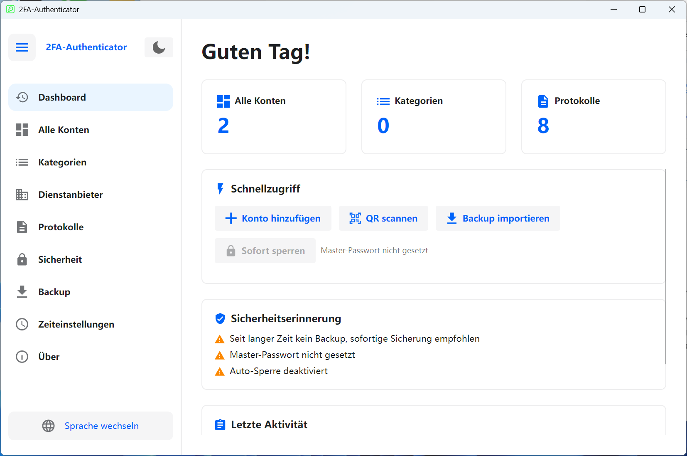

# 🔐 2FA Desktop — Plattformübergreifender Zwei-Faktor-Authentifizierung Desktop-Client

Ein Open-Source-Desktop-Manager für Zwei-Faktor-Authentifizierung (2FA), entwickelt mit [Avalonia UI](https://avaloniaui.net/), unterstützt TOTP / HOTP Protokolle, kompatibel mit **Windows** und **Linux**.

**[简体中文](README.zh-CN.md)** | **[English](README.en-US.md)** | **Deutsch** | **[Español](README.es-ES.md)** | **[Français](README.fr-FR.md)** | **[日本語](README.ja-JP.md)** | **[한국어](README.ko-KR.md)** | **[Русский](README.ru-RU.md)**

---

## 📸 Screenshots

<div align="center">

</div>

---

## ✨ Funktionen

### 🔑 Kontoverwaltung
- Unterstützt **TOTP** (zeitbasiert) und **HOTP** (zählerbasiert) OTP-Typen
- Drei Möglichkeiten zum Hinzufügen: **Manuelle Eingabe**, **URL-Import** (`otpauth://` Protokoll), **QR-Code-Massenimport**
- Massenmigration von **Google Authenticator** (Google Protobuf Protokoll-Parsing)
- Anpassbare Ziffern (6-8) und Aktualisierungszeitraum (30-60 Sekunden)
- Echtzeit-Countdown-Anzeige, Ein-Klick-Kopie in die Zwischenablage
- Konten anheften/favorisieren, Suche & Filter, Kategoriefilterung
- Rasteransicht / Listenansicht umschalten
- Mehrfachauswahl: Massenlöschen, Massenanheften, Massenverschiebung in Kategorien
- Kontoexport: QR-Code-Bild und `otpauth://` URL-Formate, Einzel- oder Massenexport

### 📂 Kategorieverwaltung
- Kategorien erstellen, umbenennen, löschen mit Beschreibung/Notizen
- Sortierung nach Name oder Kontoanzahl
- Drag-and-Drop-Neuordnung
- Mehrfachauswahl-Zusammenführung: Konten aus mehreren Kategorien in eine Zielkategorie zusammenführen
- Kategoriedetails (Kontoanzahl, Beschreibung, Sortierreihenfolge)

### 🏢 Dienstanbieter-Vorlagen
- Integrierte Symbole und Farben für gängige Anbieter (Google, GitHub, Microsoft usw.)
- Benutzerdefinierte Anbieter: SVG-Symbole hochladen, Symbolfarben festlegen
- Schnelle Vorlagenauswahl beim Hinzufügen von Konten, automatische Symbolfüllung
- Sortierung nach Name oder Nutzungshäufigkeit, Suche & Filter

### 🔒 Sicherheit
- **Master-Passwort-Schutz**: BCrypt-Hash-Speicherung, AES-GCM-verschlüsselte Kontoschlüssel
- **App-Sperre**: Master-Passwort zum Entsperren beim Start erforderlich
- **Automatische Sperre bei Inaktivität**: 1/2/5/10/15/30 Minuten (Windows unterstützt globale Inaktivitätserkennung)
- **Screenshot-Blockierung**: Systemweiter Screenshot-/Aufnahmeschutz unter Windows 10 2004+ (Screenshots zeigen schwarzen Bildschirm)
- **Automatische Zwischenablage-Löschung**: Löscht Zwischenablage nach OTP-Kopie automatisch (5/10/30/60 Sekunden)
- **Sitzungsverschlüsselung**: Laufzeit-Sitzungsschlüssel für sensible Daten
- **Sicherheitshinweis-Panel**: Visuelle Anzeige des aktuellen Sicherheitsstatus

### 💾 Sicherung & Wiederherstellung
- Export als verschlüsselte Sicherungsdateien (`.2fabackup` Format)
- **AES-GCM** Verschlüsselung + **HMAC-SHA256** Signatur mit Manipulationsschutz
- Schlüsselableitung mit **PBKDF2** (200.000 Iterationen)
- Optionale Einbeziehung von App-Einstellungen und Betriebsprotokollen
- Zwei Importmodi:
  - **Zusammenführungsmodus** (empfohlen): Bestehende Daten behalten, neue hinzufügen
  - **Überschreibmodus**: Bestehende Daten löschen, vollständig ersetzen
- Konfliktstrategien: Duplikate überspringen / Bestehende überschreiben / Beide behalten (umbenennen)
- Datenstatistik-Panel: Kontoanzahl, Kategorieanzahl, letzte Sicherungszeit

### ⏱ Zeiteinstellungen
- **Systemzeit** und **NTP-Netzwerkzeit** als Zeitquellen
- Integrierte NTP-Server: Windows Time, Alibaba Cloud, Tencent Cloud, Google, Cloudflare
- Benutzerdefinierte NTP-Server-Unterstützung
- NTP-Verbindungstest: Zeigt Netzwerkzeit und Zeitabweichung
- Gewährleistet TOTP-Code-Genauigkeit

### 📋 Betriebsprotokolle
- Vollständiger Audit-Trail (Konten hinzufügen/aktualisieren/löschen, Import/Export, Einstellungsänderungen usw.)
- Paginierung, Mehrfachauswahl-Löschung, alle Protokolle löschen
- Protokolle als CSV exportieren
- Rohprotokollformat-Umschaltung (für Debugging und Analyse)
- Lokalisierte Protokollanzeige

### 🎨 Oberfläche & Personalisierung
- **Hell/Dunkel-Thema** umschalten
- **Erststart-Assistent**: Sprach- und Themenauswahl
- **Seitenleisten-Navigation**: ein-/ausklappbar
- **Dashboard**: Schnellaktionen, Sicherheitserinnerungen, letzte Aktivitäten, Datenstatistiken
- Zeitbasierte Begrüßungen (Guten Morgen/Nachmittag/Abend)

### 🌍 Mehrsprachige Unterstützung

| Sprache | Code |
|---------|------|
| 🇨🇳 简体中文 | `zh-CN` |
| 🇺🇸 English | `en-US` |
| 🇩🇪 Deutsch | `de-DE` |
| 🇪🇸 Español | `es-ES` |
| 🇫🇷 Français | `fr-FR` |
| 🇯🇵 日本語 | `ja-JP` |
| 🇰🇷 한국어 | `ko-KR` |
| 🇷🇺 Русский | `ru-RU` |

---

## 🛠 Technologie-Stack

| Komponente | Technologie | Version |
|------------|------------|---------|
| Laufzeit | .NET | 8.0 |
| UI-Framework | Avalonia UI | 11.3.11 |
| Theme-Bibliothek | Semi.Avalonia | 11.3.7.2 |
| Datenbank | SQLite (Microsoft.Data.Sqlite) | 10.0.2 |
| Passwort-Hashing | BCrypt.Net-Next | 4.0.3 |
| QR-Code | ZXing.Net + SkiaSharp | 0.16.11 |
| SVG-Rendering | Svg.Skia | 3.4.1 |
| Grafik | SkiaSharp | 3.119.1 |
| Protobuf | Google.Protobuf | 3.28.3 |
| DI | Microsoft.Extensions.DependencyInjection | 10.0.2 |
| Kompilierung | Native AOT | — |

### Architektur
- **MVVM-Muster**: ViewModel + ObservableObject Datenbindung
- **Dependency Injection**: Microsoft.Extensions.DependencyInjection Container
- **Repository-Muster**: Datenschicht-Abstraktion
- **Service-Schicht**: Geschäftslogik von UI entkoppelt
- **Vollständig asynchron**: async/await für UI-Reaktionsfähigkeit

---

## 🚀 Schnellstart

### Aus dem Microsoft Store installieren

<a href="https://apps.microsoft.com/detail/9P178R1MVM9T?referrer=appbadge&mode=full" target="_blank" rel="noopener noreferrer"></a>

### Voraussetzungen

- [.NET 8 SDK](https://dotnet.microsoft.com/download/dotnet/8.0)
- Windows 10+ oder Linux (Ubuntu 20.04+, Debian 11+ usw.)

### Klonen

```bash
git clone https://github.com/salokrwhite/2fa-desktop.git
cd 2fa-desktop
```

### Windows Erstellen & Ausführen

```bash
# Entwicklung
dotnet run

# Release (Native AOT)
dotnet publish -c Release -r win-x64 --self-contained true -p:PublishAot=true
```

### Linux Erstellen & Ausführen

```bash
cd linux-desktop
dotnet run

# Release (Native AOT)
dotnet publish -c Release -r linux-x64 --self-contained true -p:PublishAot=true
```

### Linux .deb-Paket

```bash
chmod +x linux-desktop/build-deb.sh
./linux-desktop/build-deb.sh

# Installation
sudo apt install ./bin/deb-staging/twofactorauth-desktop_1.0.0_amd64.deb
```

---

## 📁 Projektstruktur

```
2fa-desktop/
├── App.axaml / App.axaml.cs          # App-Einstieg, Theme- und Sprachkonfiguration
├── TwoFactorAuthDesktop.csproj       # Windows-Projektdatei
├── Program.cs                        # Einstiegspunkt
│
├── Models/                           # Datenmodelle
│   ├── Account.cs                    # 2FA-Kontomodell (TOTP/HOTP)
│   ├── Category.cs                   # Kategoriemodell
│   ├── Settings.cs                   # Einstellungsmodell
│   ├── BackupData.cs                 # Sicherungsdatenstrukturen
│   ├── ServiceProvider.cs            # Dienstanbieter-Vorlagenmodell
│   ├── OperationLog.cs               # Betriebsprotokollmodell
│   └── ObservableObject.cs           # MVVM Observable-Basisklasse
│
├── ViewModels/                       # ViewModel-Schicht
│   ├── MainViewModel.cs              # Hauptfenster (Navigation, Theme, Sprache)
│   ├── DashboardViewModel.cs         # Dashboard (Schnellaktionen, Sicherheit)
│   ├── AccountListViewModel.cs       # Kontoliste (Suche, Filter, Mehrfachauswahl)
│   ├── AccountItemViewModel.cs       # Einzelnes Konto (OTP-Anzeige, Countdown)
│   ├── AddAccountViewModel.cs        # Konto hinzufügen (Manuell/URL/QR)
│   ├── CategoryListViewModel.cs      # Kategorieverwaltung
│   ├── ServiceProviderListViewModel.cs # Dienstanbieterverwaltung
│   ├── OperationLogViewModel.cs      # Betriebsprotokolle
│   ├── SecuritySettingsViewModel.cs  # Sicherheitseinstellungen
│   ├── BackupViewModel.cs            # Sicherung & Wiederherstellung
│   ├── TimeSettingsViewModel.cs      # Zeiteinstellungen
│   ├── ExportAccountViewModel.cs     # Kontoexport
│   ├── LockScreenViewModel.cs        # Sperrbildschirm
│   └── ...                           # Weitere Dialog-ViewModels
│
├── Views/                            # View-Schicht (AXAML)
│   ├── MainWindow.axaml              # Hauptfenster (Seitenleiste + Inhalt)
│   ├── BackupView.axaml              # Sicherung & Wiederherstellung
│   ├── LockScreenView.axaml          # Sperrbildschirm
│   ├── TimeSettingsView.axaml        # Zeiteinstellungen
│   ├── Dialogs/                      # Dialoge (17)
│   │   ├── UnifiedAddAccountDialog   # Einheitlicher Konto-hinzufügen-Dialog
│   │   ├── QrImportDialog            # QR-Code-Massenimport
│   │   ├── ExportBackupDialog        # Sicherung exportieren
│   │   ├── ImportBackupDialog        # Sicherung importieren
│   │   ├── ExportAccountDialog       # Konto exportieren
│   │   ├── PasswordDialog            # Passworteingabe
│   │   ├── SetPasswordDialog         # Passwort festlegen
│   │   └── ...                       # Weitere Dialoge
│   └── Wizard/                       # Erststart-Assistent
│       ├── SetupWizardView           # Assistent-Container
│       ├── WizardLanguageView        # Sprachauswahl
│       └── WizardThemeView           # Themenauswahl
│
├── Services/                         # Service-Schicht
│   ├── OtpService.cs                 # OTP-Generierung (TOTP/HOTP)
│   ├── SecurityService.cs            # Sicherheit (Verschlüsselung/Passwort)
│   ├── BackupService.cs              # Sicherung (Export/Import/Verschlüsselung)
│   ├── AccountService.cs             # Konto-CRUD
│   ├── StorageService.cs             # Speicher (Schlüsselrotation)
│   ├── AutoLockManager.cs            # Automatische Sperre
│   ├── AppLockCoordinator.cs         # App-Sperr-Koordinator
│   ├── ClipboardClearService.cs      # Zwischenablage-Löschung
│   ├── ScreenshotProtectionService.cs # Screenshot-Schutz (Windows API)
│   ├── NtpTimeProvider.cs            # NTP-Zeitanbieter
│   ├── TimeService.cs                # Zeitdienst
│   └── ...                           # Schnittstellen und Implementierungen
│
├── Data/                             # Datenzugriffsschicht
│   ├── DatabaseContext.cs            # SQLite-Kontext (Schema/Migration)
│   ├── AccountRepository.cs          # Konto-Repository
│   ├── CategoryRepository.cs         # Kategorie-Repository
│   ├── SettingsRepository.cs         # Einstellungs-Repository
│   ├── OperationLogRepository.cs     # Protokoll-Repository
│   ├── ServiceProviderRepository.cs  # Anbieter-Repository
│   ├── BuiltInServiceProviders.cs    # Integrierte Anbieterdaten
│   └── SettingKeys.cs                # Einstellungsschlüssel-Konstanten
│
├── Utils/                            # Hilfsprogramme
│   ├── TotpGenerator.cs              # TOTP-Algorithmus
│   ├── HotpGenerator.cs              # HOTP-Algorithmus (HMAC-SHA1)
│   ├── Base32.cs                     # Base32-Kodierung/Dekodierung
│   ├── OtpUriParser.cs               # otpauth:// URI-Parser
│   ├── OtpUrlGenerator.cs            # OTP-URL-Generator
│   ├── QrCodeGenerator.cs            # QR-Code-Generierung (ZXing + SkiaSharp)
│   ├── QrCodeDecoder.cs              # QR-Code-Dekodierung
│   ├── GoogleAuthMigrationParser.cs  # Google Authenticator Migrations-Parser
│   ├── SvgParser.cs / SvgImageHelper.cs # SVG-Symbolverarbeitung
│   └── ...                           # Weitere Hilfsprogramme
│
├── Converters/                       # XAML-Wertkonverter
├── Controls/                         # Benutzerdefinierte Steuerelemente (Countdown-Kreis)
├── Assets/Lang/                      # Mehrsprachige Ressourcendateien (8 Sprachen)
│
├── linux-desktop/                    # Linux-spezifisches Projekt
│   ├── TwoFactorAuthDesktop.csproj   # Linux-Projektdatei
│   ├── build-deb.sh                  # Debian-Paketierungsskript
│   ├── app.png                       # Linux-App-Symbol
│   └── ...                           # Gleiche Struktur wie Hauptprojekt
│
└── picture/                          # README-Screenshots
    ├── zh-CN.png
    ├── en-US.png
    └── ...                           # Screenshots für jede Sprache
```

---

## 🔐 Sicherheitsarchitektur

| Sicherheitsebene | Technologie |
|------------------|-------------|
| Passwortspeicher | BCrypt-Hash (automatisch gesalzen) |
| Schlüsselableitung | PBKDF2 (100.000-200.000 Iter.) |
| Datenverschlüsselung | AES-GCM (256-Bit) |
| Signatur | HMAC-SHA256 |
| OTP-Algorithmus | HMAC-SHA1 (RFC 4226 / RFC 6238) |

- **Ohne Master-Passwort**: Daten im Klartext in lokaler SQLite, geeignet für persönliche Geräte
- **Mit Master-Passwort**: Alle Kontoschlüssel mit abgeleitetem Schlüssel verschlüsselt
- **Sicherungsverschlüsselung**: Unabhängiges Sicherungspasswort, PBKDF2 + AES-GCM + HMAC
- **Offline-First**: Alle Daten lokal gespeichert, keine Cloud-Synchronisation

---

## 🤝 Mitwirken

Issues und Pull Requests sind willkommen.

1. Forken Sie dieses Repository
2. Erstellen Sie einen Feature-Branch: `git checkout -b feature/your-feature`
3. Committen Sie Änderungen: `git commit -m "Add your feature"`
4. Pushen Sie: `git push origin feature/your-feature`
5. Erstellen Sie einen Pull Request

---

## 📄 Lizenz

Dieses Projekt ist unter der [MIT-Lizenz](LICENSE) lizenziert.

Copyright © 2026 lijicheng

---

Wenn Ihnen dieses Projekt hilft, geben Sie bitte einen ⭐ Stern!

[GitHub Repository](https://github.com/salokrwhite/2fa-desktop)
