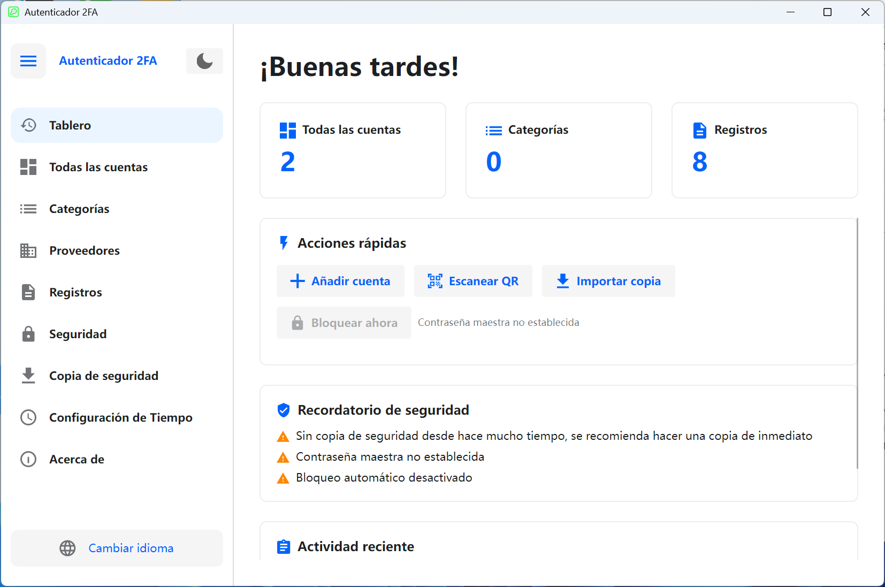

# 🔐 2FA Desktop — Cliente de escritorio multiplataforma de autenticación de dos factores

Un gestor de escritorio de autenticación de dos factores (2FA) de código abierto, desarrollado con [Avalonia UI](https://avaloniaui.net/), compatible con los protocolos TOTP / HOTP, para **Windows** y **Linux**.

**[简体中文](README.zh-CN.md)** | **[English](README.en-US.md)** | **[Deutsch](README.de-DE.md)** | **Español** | **[Français](README.fr-FR.md)** | **[日本語](README.ja-JP.md)** | **[한국어](README.ko-KR.md)** | **[Русский](README.ru-RU.md)**

</div>

---

## 📸 Capturas de pantalla

<div align="center">

</div>

---

## ✨ Características

### 🔑 Gestión de cuentas
- Soporte para tipos OTP **TOTP** (basado en tiempo) y **HOTP** (basado en contador)
- Tres formas de agregar: **Entrada manual**, **Importación URL** (protocolo `otpauth://`), **Importación masiva de códigos QR**
- Migración masiva desde **Google Authenticator** (análisis del protocolo Google Protobuf)
- Dígitos personalizables (6-8) y período de actualización (30-60 segundos)
- Cuenta regresiva en tiempo real, copia al portapapeles con un clic
- Fijar/favoritos de cuentas, búsqueda y filtro, filtrado por categoría
- Alternar entre vista de cuadrícula / vista de lista
- Modo de selección múltiple: eliminación masiva, fijado masivo, mover masivamente a categoría
- Exportación de cuentas: formatos de imagen QR y URL `otpauth://`, exportación individual o masiva

### 📂 Gestión de categorías
- Crear, renombrar, eliminar categorías con descripción/notas
- Ordenar por nombre o cantidad de cuentas
- Reordenamiento por arrastrar y soltar
- Fusión de selección múltiple: fusionar cuentas de varias categorías en una categoría destino
- Vista de detalles de categoría (cantidad de cuentas, descripción, orden)

### 🏢 Plantillas de proveedores de servicios
- Iconos y colores integrados para proveedores comunes (Google, GitHub, Microsoft, etc.)
- Proveedores personalizados: subir iconos SVG, configurar colores
- Selección rápida de plantillas al agregar cuentas, autocompletado de iconos
- Ordenar por nombre o frecuencia de uso, búsqueda y filtro

### 🔒 Seguridad
- **Protección con contraseña maestra**: almacenamiento BCrypt, secretos cifrados con AES-GCM
- **Bloqueo de aplicación**: requiere contraseña maestra al iniciar
- **Bloqueo automático por inactividad**: 1/2/5/10/15/30 minutos (Windows soporta detección global de inactividad)
- **Bloqueo de capturas de pantalla**: protección a nivel de sistema en Windows 10 2004+ (las capturas muestran pantalla negra)
- **Limpieza automática del portapapeles**: limpia automáticamente después de copiar OTP (5/10/30/60 segundos)
- **Cifrado de sesión**: clave de sesión para datos sensibles
- **Panel de avisos de seguridad**: visualización del estado de seguridad actual

### 💾 Copia de seguridad y restauración
- Exportación como archivos de respaldo cifrados (formato `.2fabackup`)
- Cifrado **AES-GCM** + firma **HMAC-SHA256** con verificación anti-manipulación
- Derivación de clave **PBKDF2** (200.000 iteraciones)
- Inclusión opcional de configuración y registros de operaciones
- Dos modos de importación:
  - **Modo fusión** (recomendado): mantener datos existentes, agregar nuevos
  - **Modo sobrescritura**: borrar datos existentes, reemplazar completamente
- Estrategias de conflicto: omitir duplicados / sobrescribir / mantener ambos (renombrar)
- Panel de estadísticas: cantidad de cuentas, categorías, última copia de seguridad

### ⏱ Configuración de tiempo
- Fuentes de tiempo: **tiempo del sistema** y **tiempo de red NTP**
- Servidores NTP integrados: Windows Time, Alibaba Cloud, Tencent Cloud, Google, Cloudflare
- Soporte para servidores NTP personalizados
- Prueba de conexión NTP: muestra hora de red y desviación
- Garantiza la precisión de generación de códigos TOTP

### 📋 Registros de operaciones
- Registro de auditoría completo (agregar/actualizar/eliminar cuentas, importar/exportar, cambios de configuración, etc.)
- Paginación, eliminación múltiple, borrar todos los registros
- Exportar registros a CSV
- Alternar formato de registro sin procesar (para depuración y análisis)
- Visualización localizada del contenido de registros

### 🎨 Interfaz y personalización
- Alternar **tema claro/oscuro**
- **Asistente de primer inicio**: selección de idioma y tema
- **Navegación lateral**: plegable/desplegable
- **Panel de control**: acciones rápidas, recordatorios de seguridad, actividad reciente, estadísticas
- Saludos según la hora (Buenos días/tardes/noches)

### 🌍 Soporte multilingüe

| Idioma | Código |
|--------|--------|
| 🇨🇳 简体中文 | `zh-CN` |
| 🇺🇸 English | `en-US` |
| 🇩🇪 Deutsch | `de-DE` |
| 🇪🇸 Español | `es-ES` |
| 🇫🇷 Français | `fr-FR` |
| 🇯🇵 日本語 | `ja-JP` |
| 🇰🇷 한국어 | `ko-KR` |
| 🇷🇺 Русский | `ru-RU` |

---

## 🛠 Stack tecnológico

| Componente | Tecnología | Versión |
|------------|-----------|---------|
| Runtime | .NET | 8.0 |
| Framework UI | Avalonia UI | 11.3.11 |
| Biblioteca de temas | Semi.Avalonia | 11.3.7.2 |
| Base de datos | SQLite (Microsoft.Data.Sqlite) | 10.0.2 |
| Hash de contraseñas | BCrypt.Net-Next | 4.0.3 |
| Código QR | ZXing.Net + SkiaSharp | 0.16.11 |
| Renderizado SVG | Svg.Skia | 3.4.1 |
| Gráficos | SkiaSharp | 3.119.1 |
| Protobuf | Google.Protobuf | 3.28.3 |
| DI | Microsoft.Extensions.DependencyInjection | 10.0.2 |
| Compilación | Native AOT | — |

### Arquitectura
- **Patrón MVVM**: ViewModel + ObservableObject enlace de datos
- **Inyección de dependencias**: contenedor Microsoft.Extensions.DependencyInjection
- **Patrón Repository**: abstracción de la capa de datos
- **Capa de servicios**: lógica de negocio desacoplada de la UI
- **Completamente asíncrono**: async/await para la capacidad de respuesta de la UI

---

## 🚀 Inicio rápido

### Instalar desde Microsoft Store

<a href="https://apps.microsoft.com/detail/9P178R1MVM9T?referrer=appbadge&mode=full" target="_blank" rel="noopener noreferrer"></a>

### Requisitos

- [.NET 8 SDK](https://dotnet.microsoft.com/download/dotnet/8.0)
- Windows 10+ o Linux (Ubuntu 20.04+, Debian 11+, etc.)

### Clonar

```bash
git clone https://github.com/salokrwhite/2fa-desktop.git
cd 2fa-desktop
```

### Windows

```bash
dotnet run
# Release (Native AOT)
dotnet publish -c Release -r win-x64 --self-contained true -p:PublishAot=true
```

### Linux

```bash
cd linux-desktop
dotnet run
# Release (Native AOT)
dotnet publish -c Release -r linux-x64 --self-contained true -p:PublishAot=true
```

### Paquete .deb de Linux

```bash
chmod +x linux-desktop/build-deb.sh
./linux-desktop/build-deb.sh
sudo apt install ./bin/deb-staging/twofactorauth-desktop_1.0.0_amd64.deb
```

---

## 📁 Estructura del proyecto

```
2fa-desktop/
├── App.axaml / App.axaml.cs          # Entrada de la app, config de tema e idioma
├── TwoFactorAuthDesktop.csproj       # Archivo de proyecto Windows
├── Program.cs                        # Punto de entrada
│
├── Models/                           # Modelos de datos
│   ├── Account.cs                    # Modelo de cuenta 2FA (TOTP/HOTP)
│   ├── Category.cs                   # Modelo de categoría
│   ├── Settings.cs                   # Modelo de configuración
│   ├── BackupData.cs                 # Estructuras de datos de respaldo
│   ├── ServiceProvider.cs            # Modelo de plantilla de proveedor
│   ├── OperationLog.cs               # Modelo de registro de operaciones
│   └── ObservableObject.cs           # Clase base MVVM Observable
│
├── ViewModels/                       # Capa ViewModel
│   ├── MainViewModel.cs              # Ventana principal (navegación, tema, idioma)
│   ├── DashboardViewModel.cs         # Panel de control (acciones rápidas, seguridad)
│   ├── AccountListViewModel.cs       # Lista de cuentas (búsqueda, filtro, selección múltiple)
│   ├── AccountItemViewModel.cs       # Elemento de cuenta (visualización OTP, cuenta regresiva)
│   ├── AddAccountViewModel.cs        # Agregar cuenta (manual/URL/QR)
│   ├── CategoryListViewModel.cs      # Gestión de categorías
│   ├── ServiceProviderListViewModel.cs # Gestión de proveedores
│   ├── OperationLogViewModel.cs      # Registros de operaciones
│   ├── SecuritySettingsViewModel.cs  # Configuración de seguridad
│   ├── BackupViewModel.cs            # Respaldo y restauración
│   ├── TimeSettingsViewModel.cs      # Configuración de tiempo
│   ├── ExportAccountViewModel.cs     # Exportación de cuentas
│   ├── LockScreenViewModel.cs        # Pantalla de bloqueo
│   └── ...                           # Otros ViewModels de diálogos
│
├── Views/                            # Capa de vistas (AXAML)
│   ├── MainWindow.axaml              # Ventana principal (barra lateral + contenido)
│   ├── BackupView.axaml              # Página de respaldo y restauración
│   ├── LockScreenView.axaml          # Página de pantalla de bloqueo
│   ├── TimeSettingsView.axaml        # Página de configuración de tiempo
│   ├── Dialogs/                      # Diálogos (17)
│   │   ├── UnifiedAddAccountDialog   # Diálogo unificado de agregar cuenta
│   │   ├── QrImportDialog            # Importación masiva de QR
│   │   ├── ExportBackupDialog        # Exportar respaldo
│   │   ├── ImportBackupDialog        # Importar respaldo
│   │   ├── ExportAccountDialog       # Exportar cuenta
│   │   ├── PasswordDialog            # Entrada de contraseña
│   │   ├── SetPasswordDialog         # Establecer contraseña
│   │   └── ...                       # Otros diálogos
│   └── Wizard/                       # Asistente de primer inicio
│       ├── SetupWizardView           # Contenedor del asistente
│       ├── WizardLanguageView        # Paso de selección de idioma
│       └── WizardThemeView           # Paso de selección de tema
│
├── Services/                         # Capa de servicios
│   ├── OtpService.cs                 # Generación OTP (TOTP/HOTP)
│   ├── SecurityService.cs            # Seguridad (cifrado/contraseñas)
│   ├── BackupService.cs              # Respaldo (exportar/importar/cifrar)
│   ├── AccountService.cs             # CRUD de cuentas
│   ├── StorageService.cs             # Almacenamiento (rotación de secretos)
│   ├── AutoLockManager.cs            # Gestión de bloqueo automático
│   ├── AppLockCoordinator.cs         # Coordinador de bloqueo de app
│   ├── ClipboardClearService.cs      # Servicio de limpieza de portapapeles
│   ├── ScreenshotProtectionService.cs # Protección de capturas (API Windows)
│   ├── NtpTimeProvider.cs            # Proveedor de tiempo NTP
│   ├── TimeService.cs                # Servicio de tiempo
│   └── ...                           # Interfaces y otras implementaciones
│
├── Data/                             # Capa de acceso a datos
│   ├── DatabaseContext.cs            # Contexto SQLite (esquema/migración)
│   ├── AccountRepository.cs          # Repositorio de cuentas
│   ├── CategoryRepository.cs         # Repositorio de categorías
│   ├── SettingsRepository.cs         # Repositorio de configuración
│   ├── OperationLogRepository.cs     # Repositorio de registros
│   ├── ServiceProviderRepository.cs  # Repositorio de proveedores
│   ├── BuiltInServiceProviders.cs    # Datos de proveedores integrados
│   └── SettingKeys.cs                # Constantes de claves de configuración
│
├── Utils/                            # Utilidades
│   ├── TotpGenerator.cs              # Algoritmo TOTP
│   ├── HotpGenerator.cs              # Algoritmo HOTP (HMAC-SHA1)
│   ├── Base32.cs                     # Codificación/decodificación Base32
│   ├── OtpUriParser.cs               # Parser URI otpauth://
│   ├── OtpUrlGenerator.cs            # Generador de URL OTP
│   ├── QrCodeGenerator.cs            # Generación de QR (ZXing + SkiaSharp)
│   ├── QrCodeDecoder.cs              # Decodificación de QR
│   ├── GoogleAuthMigrationParser.cs  # Parser de migración Google Authenticator
│   ├── SvgParser.cs / SvgImageHelper.cs # Procesamiento de iconos SVG
│   └── ...                           # Otras utilidades
│
├── Converters/                       # Convertidores de valores XAML
├── Controls/                         # Controles personalizados (cuenta regresiva circular)
├── Assets/Lang/                      # Archivos de recursos multilingües (8 idiomas)
│
├── linux-desktop/                    # Proyecto específico de Linux
│   ├── TwoFactorAuthDesktop.csproj   # Archivo de proyecto Linux
│   ├── build-deb.sh                  # Script de empaquetado Debian
│   ├── app.png                       # Icono de la app Linux
│   └── ...                           # Misma estructura que el proyecto principal
│
└── picture/                          # Capturas de pantalla del README
    ├── zh-CN.png
    ├── en-US.png
    └── ...                           # Capturas para cada idioma
```

---

## 🔐 Arquitectura de seguridad

| Capa de seguridad | Tecnología |
|-------------------|------------|
| Almacenamiento | BCrypt hash (sal automática) |
| Derivación de clave | PBKDF2 (100.000-200.000 iter.) |
| Cifrado de datos | AES-GCM (256 bits) |
| Firma | HMAC-SHA256 |
| Algoritmo OTP | HMAC-SHA1 (RFC 4226 / RFC 6238) |

- **Sin contraseña maestra**: datos en texto plano en SQLite local, adecuado para dispositivos personales
- **Con contraseña maestra**: todos los secretos cifrados con clave derivada de la contraseña maestra
- **Cifrado de respaldos**: contraseña independiente, PBKDF2 + AES-GCM + HMAC
- **Offline-first**: todos los datos almacenados localmente, sin sincronización en la nube

---

## 🤝 Contribuir

Issues y Pull Requests son bienvenidos.

1. Haz fork de este repositorio
2. Crea una rama: `git checkout -b feature/your-feature`
3. Haz commit: `git commit -m "Add your feature"`
4. Haz push: `git push origin feature/your-feature`
5. Envía un Pull Request

---

## 📄 Licencia

Este proyecto está licenciado bajo la [Licencia MIT](LICENSE).

Copyright © 2026 lijicheng

---

Si este proyecto te ayuda, ¡dale una ⭐ estrella!

[Repositorio GitHub](https://github.com/salokrwhite/2fa-desktop)
