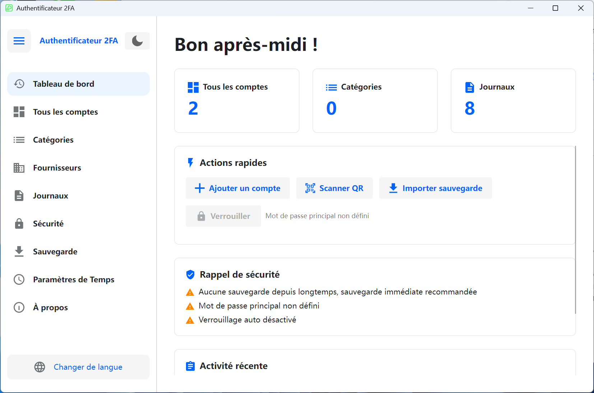

# 🔐 2FA Desktop — Client de bureau multiplateforme d'authentification à deux facteurs

Un gestionnaire open-source d'authentification à deux facteurs (2FA) de bureau, développé avec [Avalonia UI](https://avaloniaui.net/), prenant en charge les protocoles TOTP / HOTP, compatible avec **Windows** et **Linux**.

**[简体中文](README.zh-CN.md)** | **[English](README.en-US.md)** | **[Deutsch](README.de-DE.md)** | **[Español](README.es-ES.md)** | **Français** | **[日本語](README.ja-JP.md)** | **[한국어](README.ko-KR.md)** | **[Русский](README.ru-RU.md)**

---

## 📸 Captures d'écran

<div align="center">

</div>

---

## ✨ Fonctionnalités

### 🔑 Gestion des comptes
- Prise en charge des types OTP **TOTP** (basé sur le temps) et **HOTP** (basé sur le compteur)
- Trois méthodes d'ajout : **Saisie manuelle**, **Import URL** (protocole `otpauth://`), **Import par lot de QR codes**
- Migration par lot depuis **Google Authenticator** (analyse du protocole Google Protobuf)
- Chiffres personnalisables (6-8) et période de rafraîchissement (30-60 secondes)
- Affichage du compte à rebours en temps réel, copie en un clic dans le presse-papiers
- Épingler/favoriser les comptes, recherche et filtre, filtrage par catégorie
- Basculer entre vue grille / vue liste
- Mode multi-sélection : suppression par lot, épinglage par lot, déplacement par lot vers une catégorie
- Export de comptes : formats QR code et URL `otpauth://`, export unique ou par lot

### 📂 Gestion des catégories
- Créer, renommer, supprimer des catégories avec description/notes
- Tri par nom ou nombre de comptes
- Réorganisation par glisser-déposer
- Fusion multi-sélection : fusionner les comptes de plusieurs catégories vers une catégorie cible
- Vue détaillée des catégories (nombre de comptes, description, ordre de tri)

### 🏢 Modèles de fournisseurs de services
- Icônes et couleurs intégrées pour les fournisseurs courants (Google, GitHub, Microsoft, etc.)
- Fournisseurs personnalisés : télécharger des icônes SVG, définir les couleurs
- Sélection rapide de modèles lors de l'ajout de comptes, remplissage automatique des icônes
- Tri par nom ou fréquence d'utilisation, recherche et filtre

### 🔒 Sécurité
- **Protection par mot de passe maître** : stockage BCrypt, secrets chiffrés AES-GCM
- **Verrouillage de l'application** : mot de passe maître requis au démarrage
- **Verrouillage automatique en cas d'inactivité** : 1/2/5/10/15/30 minutes (Windows prend en charge la détection globale d'inactivité)
- **Blocage des captures d'écran** : protection au niveau système sous Windows 10 2004+ (les captures affichent un écran noir)
- **Effacement automatique du presse-papiers** : efface automatiquement après copie OTP (5/10/30/60 secondes)
- **Chiffrement de session** : clé de session pour les données sensibles
- **Panneau d'avis de sécurité** : affichage visuel de l'état de sécurité actuel

### 💾 Sauvegarde et restauration
- Export en fichiers de sauvegarde chiffrés (format `.2fabackup`)
- Chiffrement **AES-GCM** + signature **HMAC-SHA256** avec vérification anti-falsification
- Dérivation de clé **PBKDF2** (200 000 itérations)
- Inclusion optionnelle des paramètres et journaux d'opérations
- Deux modes d'import :
  - **Mode fusion** (recommandé) : conserver les données existantes, ajouter les nouvelles
  - **Mode écrasement** : effacer les données existantes, remplacer entièrement
- Stratégies de conflit : ignorer les doublons / écraser / conserver les deux (renommer)
- Panneau de statistiques : nombre de comptes, catégories, dernière sauvegarde

### ⏱ Paramètres de temps
- Sources de temps **système** et **NTP réseau**
- Serveurs NTP intégrés : Windows Time, Alibaba Cloud, Tencent Cloud, Google, Cloudflare
- Prise en charge de serveurs NTP personnalisés
- Test de connexion NTP : affiche l'heure réseau et l'écart de temps
- Garantit la précision de la génération des codes TOTP

### 📋 Journaux d'opérations
- Piste d'audit complète (ajout/mise à jour/suppression de comptes, import/export, modifications de paramètres, etc.)
- Pagination, suppression multi-sélection, effacement de tous les journaux
- Export des journaux en CSV
- Basculement du format brut (pour le débogage et l'analyse)
- Affichage localisé du contenu des journaux

### 🎨 Interface et personnalisation
- Basculement **thème clair/sombre**
- **Assistant de premier lancement** : sélection de la langue et du thème
- **Navigation latérale** : repliable/dépliable
- **Tableau de bord** : actions rapides, rappels de sécurité, activité récente, statistiques
- Salutations selon l'heure (Bonjour/Bon après-midi/Bonsoir)

### 🌍 Support multilingue

| Langue | Code |
|--------|------|
| 🇨🇳 简体中文 | `zh-CN` |
| 🇺🇸 English | `en-US` |
| 🇩🇪 Deutsch | `de-DE` |
| 🇪🇸 Español | `es-ES` |
| 🇫🇷 Français | `fr-FR` |
| 🇯🇵 日本語 | `ja-JP` |
| 🇰🇷 한국어 | `ko-KR` |
| 🇷🇺 Русский | `ru-RU` |

---

## 🛠 Stack technique

| Composant | Technologie | Version |
|-----------|------------|---------|
| Runtime | .NET | 8.0 |
| Framework UI | Avalonia UI | 11.3.11 |
| Bibliothèque de thèmes | Semi.Avalonia | 11.3.7.2 |
| Base de données | SQLite (Microsoft.Data.Sqlite) | 10.0.2 |
| Hachage de mots de passe | BCrypt.Net-Next | 4.0.3 |
| QR Code | ZXing.Net + SkiaSharp | 0.16.11 |
| Rendu SVG | Svg.Skia | 3.4.1 |
| Graphiques | SkiaSharp | 3.119.1 |
| Protobuf | Google.Protobuf | 3.28.3 |
| DI | Microsoft.Extensions.DependencyInjection | 10.0.2 |
| Compilation | Native AOT | — |

### Architecture
- **Modèle MVVM** : ViewModel + ObservableObject liaison de données
- **Injection de dépendances** : conteneur Microsoft.Extensions.DependencyInjection
- **Modèle Repository** : abstraction de la couche de données
- **Couche de services** : logique métier découplée de l'UI
- **Entièrement asynchrone** : async/await pour la réactivité de l'UI

---

## 🚀 Démarrage rapide

### Installer depuis le Microsoft Store

<a href="https://apps.microsoft.com/detail/9P178R1MVM9T?referrer=appbadge&mode=full" target="_blank" rel="noopener noreferrer"></a>

### Prérequis

- [.NET 8 SDK](https://dotnet.microsoft.com/download/dotnet/8.0)
- Windows 10+ ou Linux (Ubuntu 20.04+, Debian 11+, etc.)

### Cloner

```bash
git clone https://github.com/salokrwhite/2fa-desktop.git
cd 2fa-desktop
```

### Windows

```bash
dotnet run
# Release (Native AOT)
dotnet publish -c Release -r win-x64 --self-contained true -p:PublishAot=true
```

### Linux

```bash
cd linux-desktop
dotnet run
# Release (Native AOT)
dotnet publish -c Release -r linux-x64 --self-contained true -p:PublishAot=true
```

### Paquet .deb Linux

```bash
chmod +x linux-desktop/build-deb.sh
./linux-desktop/build-deb.sh
sudo apt install ./bin/deb-staging/twofactorauth-desktop_1.0.0_amd64.deb
```

---

## 📁 Structure du projet

```
2fa-desktop/
├── App.axaml / App.axaml.cs          # Entrée de l'app, config thème et langue
├── TwoFactorAuthDesktop.csproj       # Fichier projet Windows
├── Program.cs                        # Point d'entrée
│
├── Models/                           # Modèles de données
│   ├── Account.cs                    # Modèle de compte 2FA (TOTP/HOTP)
│   ├── Category.cs                   # Modèle de catégorie
│   ├── Settings.cs                   # Modèle de paramètres
│   ├── BackupData.cs                 # Structures de données de sauvegarde
│   ├── ServiceProvider.cs            # Modèle de fournisseur de services
│   ├── OperationLog.cs               # Modèle de journal d'opérations
│   └── ObservableObject.cs           # Classe de base MVVM observable
│
├── ViewModels/                       # Couche ViewModel
│   ├── MainViewModel.cs              # Fenêtre principale (navigation, thème, langue)
│   ├── DashboardViewModel.cs         # Tableau de bord (actions rapides, sécurité)
│   ├── AccountListViewModel.cs       # Liste des comptes (recherche, filtre, multi-sélection)
│   ├── AccountItemViewModel.cs       # Élément de compte (affichage OTP, compte à rebours)
│   ├── AddAccountViewModel.cs        # Ajout de compte (manuel/URL/QR)
│   ├── CategoryListViewModel.cs      # Gestion des catégories
│   ├── ServiceProviderListViewModel.cs # Gestion des fournisseurs
│   ├── OperationLogViewModel.cs      # Journaux d'opérations
│   ├── SecuritySettingsViewModel.cs  # Paramètres de sécurité
│   ├── BackupViewModel.cs            # Sauvegarde et restauration
│   ├── TimeSettingsViewModel.cs      # Paramètres de temps
│   ├── ExportAccountViewModel.cs     # Export de comptes
│   ├── LockScreenViewModel.cs        # Écran de verrouillage
│   └── ...                           # Autres ViewModels de dialogues
│
├── Views/                            # Couche Vue (AXAML)
│   ├── MainWindow.axaml              # Fenêtre principale (barre latérale + contenu)
│   ├── BackupView.axaml              # Page de sauvegarde et restauration
│   ├── LockScreenView.axaml          # Page de verrouillage
│   ├── TimeSettingsView.axaml        # Page de paramètres de temps
│   ├── Dialogs/                      # Dialogues (17)
│   │   ├── UnifiedAddAccountDialog   # Dialogue unifié d'ajout de compte
│   │   ├── QrImportDialog            # Import par lot de QR codes
│   │   ├── ExportBackupDialog        # Export de sauvegarde
│   │   ├── ImportBackupDialog        # Import de sauvegarde
│   │   ├── ExportAccountDialog       # Export de compte
│   │   ├── PasswordDialog            # Saisie de mot de passe
│   │   ├── SetPasswordDialog         # Définition de mot de passe
│   │   └── ...                       # Autres dialogues
│   └── Wizard/                       # Assistant de premier lancement
│       ├── SetupWizardView           # Conteneur de l'assistant
│       ├── WizardLanguageView        # Étape de sélection de langue
│       └── WizardThemeView           # Étape de sélection de thème
│
├── Services/                         # Couche de services
│   ├── OtpService.cs                 # Génération OTP (TOTP/HOTP)
│   ├── SecurityService.cs            # Sécurité (chiffrement/mot de passe)
│   ├── BackupService.cs              # Sauvegarde (export/import/chiffrement)
│   ├── AccountService.cs             # CRUD de comptes
│   ├── StorageService.cs             # Stockage (rotation des clés)
│   ├── AutoLockManager.cs            # Gestion du verrouillage automatique
│   ├── AppLockCoordinator.cs         # Coordinateur de verrouillage
│   ├── ClipboardClearService.cs      # Service de nettoyage du presse-papiers
│   ├── ScreenshotProtectionService.cs # Protection contre les captures (API Windows)
│   ├── NtpTimeProvider.cs            # Fournisseur de temps NTP
│   ├── TimeService.cs                # Service de temps
│   └── ...                           # Interfaces et autres implémentations
│
├── Data/                             # Couche d'accès aux données
│   ├── DatabaseContext.cs            # Contexte SQLite (schéma/migration)
│   ├── AccountRepository.cs          # Repository de comptes
│   ├── CategoryRepository.cs         # Repository de catégories
│   ├── SettingsRepository.cs         # Repository de paramètres
│   ├── OperationLogRepository.cs     # Repository de journaux
│   ├── ServiceProviderRepository.cs  # Repository de fournisseurs
│   ├── BuiltInServiceProviders.cs    # Données de fournisseurs intégrés
│   └── SettingKeys.cs                # Constantes de clés de paramètres
│
├── Utils/                            # Utilitaires
│   ├── TotpGenerator.cs              # Algorithme TOTP
│   ├── HotpGenerator.cs              # Algorithme HOTP (HMAC-SHA1)
│   ├── Base32.cs                     # Encodage/décodage Base32
│   ├── OtpUriParser.cs               # Parseur URI otpauth://
│   ├── OtpUrlGenerator.cs            # Générateur d'URL OTP
│   ├── QrCodeGenerator.cs            # Génération de QR codes (ZXing + SkiaSharp)
│   ├── QrCodeDecoder.cs              # Décodage de QR codes
│   ├── GoogleAuthMigrationParser.cs  # Parseur de migration Google Authenticator
│   ├── SvgParser.cs / SvgImageHelper.cs # Traitement des icônes SVG
│   └── ...                           # Autres utilitaires
│
├── Converters/                       # Convertisseurs de valeurs XAML
├── Controls/                         # Contrôles personnalisés (compte à rebours circulaire)
├── Assets/Lang/                      # Fichiers de ressources multilingues (8 langues)
│
├── linux-desktop/                    # Projet spécifique Linux
│   ├── TwoFactorAuthDesktop.csproj   # Fichier projet Linux
│   ├── build-deb.sh                  # Script de packaging Debian
│   ├── app.png                       # Icône de l'app Linux
│   └── ...                           # Même structure que le projet principal
│
└── picture/                          # Captures d'écran du README
    ├── zh-CN.png
    ├── en-US.png
    └── ...                           # Captures pour chaque langue
```

---

## 🔐 Architecture de sécurité

| Couche de sécurité | Technologie |
|--------------------|-------------|
| Stockage mot de passe | BCrypt (salage automatique) |
| Dérivation de clé | PBKDF2 (100 000-200 000 itér.) |
| Chiffrement données | AES-GCM (256 bits) |
| Signature | HMAC-SHA256 |
| Algorithme OTP | HMAC-SHA1 (RFC 4226 / RFC 6238) |

- **Sans mot de passe maître** : données en clair dans SQLite local, adapté aux appareils personnels
- **Avec mot de passe maître** : tous les secrets chiffrés avec une clé dérivée du mot de passe maître
- **Chiffrement des sauvegardes** : mot de passe indépendant, PBKDF2 + AES-GCM + HMAC
- **Offline-first** : toutes les données stockées localement, pas de synchronisation cloud

---

## 🤝 Contribuer

Les Issues et Pull Requests sont les bienvenues.

1. Forkez ce dépôt
2. Créez une branche : `git checkout -b feature/your-feature`
3. Committez : `git commit -m "Add your feature"`
4. Poussez : `git push origin feature/your-feature`
5. Soumettez une Pull Request

---

## 📄 Licence

Ce projet est sous licence [MIT](LICENSE).

Copyright © 2026 lijicheng

---

Si ce projet vous aide, merci de lui donner une ⭐ étoile !

[Dépôt GitHub](https://github.com/salokrwhite/2fa-desktop)
