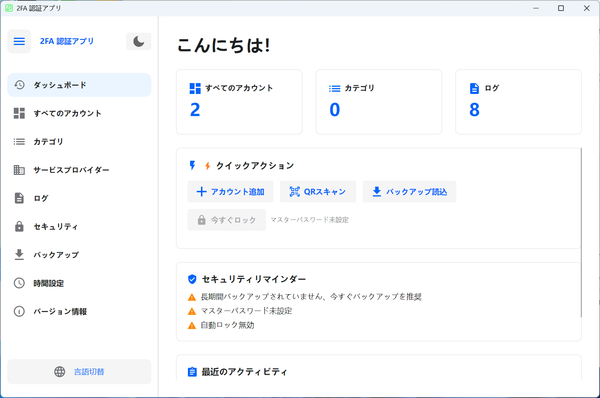

# 🔐 2FA Desktop — クロスプラットフォーム二要素認証デスクトップクライアント

[Avalonia UI](https://avaloniaui.net/) で構築されたオープンソースのデスクトップ二要素認証（2FA）マネージャー。TOTP / HOTP プロトコルに対応し、**Windows** と **Linux** の両方をサポートします。

**[简体中文](README.zh-CN.md)** | **[English](README.en-US.md)** | **[Deutsch](README.de-DE.md)** | **[Español](README.es-ES.md)** | **[Français](README.fr-FR.md)** | **日本語** | **[한국어](README.ko-KR.md)** | **[Русский](README.ru-RU.md)**

---

## 📸 スクリーンショット

<div align="center">

</div>

---

## ✨ 機能

### 🔑 アカウント管理
- **TOTP**（時間ベース）と **HOTP**（カウンターベース）の両方のOTPタイプに対応
- 3つの追加方法：**手動入力**、**URLインポート**（`otpauth://` プロトコル）、**QRコード一括インポート**
- **Google Authenticator** からの一括移行（Google Protobuf プロトコル解析）
- カスタマイズ可能な桁数（6-8桁）と更新周期（30-60秒）
- リアルタイムカウントダウン表示、ワンクリックでクリップボードにコピー
- アカウントのピン留め/お気に入り、検索＆フィルター、カテゴリフィルタリング
- グリッドビュー / リストビュー切り替え
- 複数選択モード：一括削除、一括ピン留め、一括カテゴリ移動
- アカウントエクスポート：QRコード画像と `otpauth://` URL形式、単体または一括エクスポート

### 📂 カテゴリ管理
- カテゴリの作成、名前変更、削除（説明/メモ付き）
- 名前またはアカウント数でソート
- ドラッグ＆ドロップで並べ替え
- 複数選択マージ：複数カテゴリのアカウントをターゲットカテゴリに統合
- カテゴリ詳細表示（アカウント数、説明、ソート順）

### 🏢 サービスプロバイダーテンプレート
- 一般的なプロバイダーの組み込みアイコンと色（Google、GitHub、Microsoftなど）
- カスタムプロバイダー：SVGアイコンのアップロード、アイコン色の設定
- アカウント追加時のクイックテンプレート選択、アイコン自動入力
- 名前または使用回数でソート、検索＆フィルター

### 🔒 セキュリティ
- **マスターパスワード保護**：BCryptハッシュ保存、AES-GCMでアカウントシークレットを暗号化
- **アプリロック**：起動時にマスターパスワードが必要
- **アイドル自動ロック**：1/2/5/10/15/30分（Windowsはグローバルアイドル検出対応）
- **スクリーンショットブロック**：Windows 10 2004+でシステムレベルのスクリーンショット/録画保護（スクリーンショットは黒画面表示）
- **クリップボード自動クリア**：OTPコピー後に自動クリア（5/10/30/60秒）
- **セッション暗号化**：ランタイムセッションキーで機密データを暗号化
- **セキュリティ通知パネル**：現在のセキュリティ状態を視覚的に表示

### 💾 バックアップと復元
- 暗号化バックアップファイルとしてエクスポート（`.2fabackup` 形式）
- **AES-GCM** 暗号化 + **HMAC-SHA256** 署名（改ざん検証付き）
- **PBKDF2** による鍵導出（200,000回反復）
- アプリ設定と操作ログのオプション含有
- 2つのインポートモード：
  - **マージモード**（推奨）：既存データを保持し、新しいデータを追加
  - **上書きモード**：既存データをクリアし、完全に置換
- 競合戦略：重複をスキップ / 既存を上書き / 両方を保持（リネーム）
- データ統計パネル：アカウント数、カテゴリ数、最終バックアップ時刻

### ⏱ 時刻設定
- **システム時刻** と **NTPネットワーク時刻** の2つの時刻ソース
- 組み込みNTPサーバー：Windows Time、Alibaba Cloud、Tencent Cloud、Google、Cloudflare
- カスタムNTPサーバーのサポート
- NTP接続テスト：ネットワーク時刻と時刻偏差を表示
- TOTP コード生成の時刻精度を保証

### 📋 操作ログ
- 完全な監査証跡（アカウントの追加/更新/削除、インポート/エクスポート、設定変更など）
- ページネーション、複数選択削除、全ログクリア
- CSVへのログエクスポート
- 生ログ形式の切り替え（デバッグと分析用）
- ローカライズされたログ表示

### 🎨 UIとパーソナライゼーション
- **ライト/ダークテーマ** 切り替え
- **初回起動ウィザード**：言語とテーマの選択
- **サイドバーナビゲーション**：折りたたみ/展開可能
- **ダッシュボード**：クイックアクション、セキュリティリマインダー、最近のアクティビティ、データ統計
- 時間帯に応じた挨拶（おはようございます/こんにちは/こんばんは）

### 🌍 多言語サポート

| 言語 | コード |
|------|--------|
| 🇨🇳 简体中文 | `zh-CN` |
| 🇺🇸 English | `en-US` |
| 🇩🇪 Deutsch | `de-DE` |
| 🇪🇸 Español | `es-ES` |
| 🇫🇷 Français | `fr-FR` |
| 🇯🇵 日本語 | `ja-JP` |
| 🇰🇷 한국어 | `ko-KR` |
| 🇷🇺 Русский | `ru-RU` |

---

## 🛠 技術スタック

| コンポーネント | 技術 | バージョン |
|--------------|------|-----------|
| ランタイム | .NET | 8.0 |
| UIフレームワーク | Avalonia UI | 11.3.11 |
| テーマライブラリ | Semi.Avalonia | 11.3.7.2 |
| データベース | SQLite (Microsoft.Data.Sqlite) | 10.0.2 |
| パスワードハッシュ | BCrypt.Net-Next | 4.0.3 |
| QRコード | ZXing.Net + SkiaSharp | 0.16.11 |
| SVGレンダリング | Svg.Skia | 3.4.1 |
| グラフィックス | SkiaSharp | 3.119.1 |
| Protobuf | Google.Protobuf | 3.28.3 |
| DI | Microsoft.Extensions.DependencyInjection | 10.0.2 |
| コンパイル | Native AOT | — |

### アーキテクチャ
- **MVVMパターン**：ViewModel + ObservableObject データバインディング
- **依存性注入**：Microsoft.Extensions.DependencyInjection コンテナ
- **リポジトリパターン**：データ層の抽象化
- **サービス層**：ビジネスロジックとUIの分離
- **完全非同期**：async/await によるUI応答性

---

## 🚀 クイックスタート

### Microsoft Store からインストール

<a href="https://apps.microsoft.com/detail/9P178R1MVM9T?referrer=appbadge&mode=full" target="_blank" rel="noopener noreferrer"></a>


### 必要条件

- [.NET 8 SDK](https://dotnet.microsoft.com/download/dotnet/8.0)
- Windows 10+ または Linux（Ubuntu 20.04+、Debian 11+ など）

### クローン

```bash
git clone https://github.com/salokrwhite/2fa-desktop.git
cd 2fa-desktop
```

### Windows ビルド＆実行

```bash
dotnet run
# リリース (Native AOT)
dotnet publish -c Release -r win-x64 --self-contained true -p:PublishAot=true
```

### Linux ビルド＆実行

```bash
cd linux-desktop
dotnet run
# リリース (Native AOT)
dotnet publish -c Release -r linux-x64 --self-contained true -p:PublishAot=true
```

### Linux .deb パッケージ

```bash
chmod +x linux-desktop/build-deb.sh
./linux-desktop/build-deb.sh
sudo apt install ./bin/deb-staging/twofactorauth-desktop_1.0.0_amd64.deb
```

---

## 📁 プロジェクト構造

```
2fa-desktop/
├── App.axaml / App.axaml.cs          # アプリエントリ、テーマ・言語設定
├── TwoFactorAuthDesktop.csproj       # Windows プロジェクトファイル
├── Program.cs                        # エントリポイント
│
├── Models/                           # データモデル
│   ├── Account.cs                    # 2FA アカウントモデル (TOTP/HOTP)
│   ├── Category.cs                   # カテゴリモデル
│   ├── Settings.cs                   # 設定モデル
│   ├── BackupData.cs                 # バックアップデータ構造
│   ├── ServiceProvider.cs            # サービスプロバイダーテンプレートモデル
│   ├── OperationLog.cs               # 操作ログモデル
│   └── ObservableObject.cs           # MVVM Observable 基底クラス
│
├── ViewModels/                       # ViewModel 層
│   ├── MainViewModel.cs              # メインウィンドウ（ナビゲーション、テーマ、言語）
│   ├── DashboardViewModel.cs         # ダッシュボード（クイックアクション、セキュリティ）
│   ├── AccountListViewModel.cs       # アカウントリスト（検索、フィルター、複数選択）
│   ├── AccountItemViewModel.cs       # 単一アカウント（OTP表示、カウントダウン）
│   ├── AddAccountViewModel.cs        # アカウント追加（手動/URL/QR）
│   ├── CategoryListViewModel.cs      # カテゴリ管理
│   ├── ServiceProviderListViewModel.cs # サービスプロバイダー管理
│   ├── OperationLogViewModel.cs      # 操作ログ
│   ├── SecuritySettingsViewModel.cs  # セキュリティ設定
│   ├── BackupViewModel.cs            # バックアップと復元
│   ├── TimeSettingsViewModel.cs      # 時刻設定
│   ├── ExportAccountViewModel.cs     # アカウントエクスポート
│   ├── LockScreenViewModel.cs        # ロック画面
│   └── ...                           # その他のダイアログ ViewModel
│
├── Views/                            # ビュー層 (AXAML)
│   ├── MainWindow.axaml              # メインウィンドウ（サイドバー + コンテンツ）
│   ├── BackupView.axaml              # バックアップと復元ページ
│   ├── LockScreenView.axaml          # ロック画面ページ
│   ├── TimeSettingsView.axaml        # 時刻設定ページ
│   ├── Dialogs/                      # ダイアログ (17個)
│   │   ├── UnifiedAddAccountDialog   # 統合アカウント追加ダイアログ
│   │   ├── QrImportDialog            # QRコード一括インポート
│   │   ├── ExportBackupDialog        # バックアップエクスポート
│   │   ├── ImportBackupDialog        # バックアップインポート
│   │   ├── ExportAccountDialog       # アカウントエクスポート
│   │   ├── PasswordDialog            # パスワード入力
│   │   ├── SetPasswordDialog         # パスワード設定
│   │   └── ...                       # その他のダイアログ
│   └── Wizard/                       # 初回起動ウィザード
│       ├── SetupWizardView           # ウィザードコンテナ
│       ├── WizardLanguageView        # 言語選択ステップ
│       └── WizardThemeView           # テーマ選択ステップ
│
├── Services/                         # サービス層
│   ├── OtpService.cs                 # OTP生成 (TOTP/HOTP)
│   ├── SecurityService.cs            # セキュリティ（暗号化/復号/パスワード）
│   ├── BackupService.cs              # バックアップ（エクスポート/インポート/暗号化）
│   ├── AccountService.cs             # アカウント CRUD
│   ├── StorageService.cs             # ストレージ（シークレットローテーション）
│   ├── AutoLockManager.cs            # 自動ロック管理
│   ├── AppLockCoordinator.cs         # アプリロックコーディネーター
│   ├── ClipboardClearService.cs      # クリップボードクリアサービス
│   ├── ScreenshotProtectionService.cs # スクリーンショット保護 (Windows API)
│   ├── NtpTimeProvider.cs            # NTP タイムプロバイダー
│   ├── TimeService.cs                # タイムサービス
│   └── ...                           # インターフェースとその他の実装
│
├── Data/                             # データアクセス層
│   ├── DatabaseContext.cs            # SQLite コンテキスト（スキーマ/マイグレーション）
│   ├── AccountRepository.cs          # アカウントリポジトリ
│   ├── CategoryRepository.cs         # カテゴリリポジトリ
│   ├── SettingsRepository.cs         # 設定リポジトリ
│   ├── OperationLogRepository.cs     # 操作ログリポジトリ
│   ├── ServiceProviderRepository.cs  # サービスプロバイダーリポジトリ
│   ├── BuiltInServiceProviders.cs    # 組み込みプロバイダーデータ
│   └── SettingKeys.cs                # 設定キー定数
│
├── Utils/                            # ユーティリティ
│   ├── TotpGenerator.cs              # TOTP アルゴリズム
│   ├── HotpGenerator.cs              # HOTP アルゴリズム (HMAC-SHA1)
│   ├── Base32.cs                     # Base32 エンコード/デコード
│   ├── OtpUriParser.cs               # otpauth:// URI パーサー
│   ├── OtpUrlGenerator.cs            # OTP URL ジェネレーター
│   ├── QrCodeGenerator.cs            # QRコード生成 (ZXing + SkiaSharp)
│   ├── QrCodeDecoder.cs              # QRコードデコード
│   ├── GoogleAuthMigrationParser.cs  # Google Authenticator 移行パーサー
│   ├── SvgParser.cs / SvgImageHelper.cs # SVG アイコン処理
│   └── ...                           # その他のユーティリティ
│
├── Converters/                       # XAML 値コンバーター
├── Controls/                         # カスタムコントロール（カウントダウンパイ）
├── Assets/Lang/                      # 多言語リソースファイル（8言語）
│
├── linux-desktop/                    # Linux 専用プロジェクト
│   ├── TwoFactorAuthDesktop.csproj   # Linux プロジェクトファイル
│   ├── build-deb.sh                  # Debian パッケージングスクリプト
│   ├── app.png                       # Linux アプリアイコン
│   └── ...                           # メインプロジェクトと同じ構造
│
└── picture/                          # README スクリーンショット
    ├── zh-CN.png
    ├── en-US.png
    └── ...                           # 各言語のスクリーンショット
```

---

## 🔐 セキュリティアーキテクチャ

| セキュリティ層 | 技術方式 |
|---------------|---------|
| パスワード保存 | BCryptハッシュ（自動ソルト） |
| 鍵導出 | PBKDF2 (100,000-200,000回反復) |
| データ暗号化 | AES-GCM (256ビット) |
| 署名 | HMAC-SHA256 |
| OTPアルゴリズム | HMAC-SHA1 (RFC 4226 / RFC 6238) |

- **マスターパスワードなし**：ローカルSQLiteに平文で保存、個人デバイス向け
- **マスターパスワードあり**：全アカウントシークレットをマスターパスワード派生キーで暗号化
- **バックアップ暗号化**：独立したバックアップパスワード、PBKDF2 + AES-GCM + HMAC
- **オフラインファースト**：全データをローカル保存、クラウド同期なし

---

## 🤝 コントリビューション

IssueとPull Requestを歓迎します。

1. このリポジトリをフォーク
2. フィーチャーブランチを作成：`git checkout -b feature/your-feature`
3. 変更をコミット：`git commit -m "Add your feature"`
4. プッシュ：`git push origin feature/your-feature`
5. Pull Requestを提出

---

## 📄 ライセンス

このプロジェクトは [MIT License](LICENSE) の下でライセンスされています。

Copyright © 2026 lijicheng

---

このプロジェクトが役に立ったら、⭐ スターをお願いします！

[GitHub リポジトリ](https://github.com/salokrwhite/2fa-desktop)
