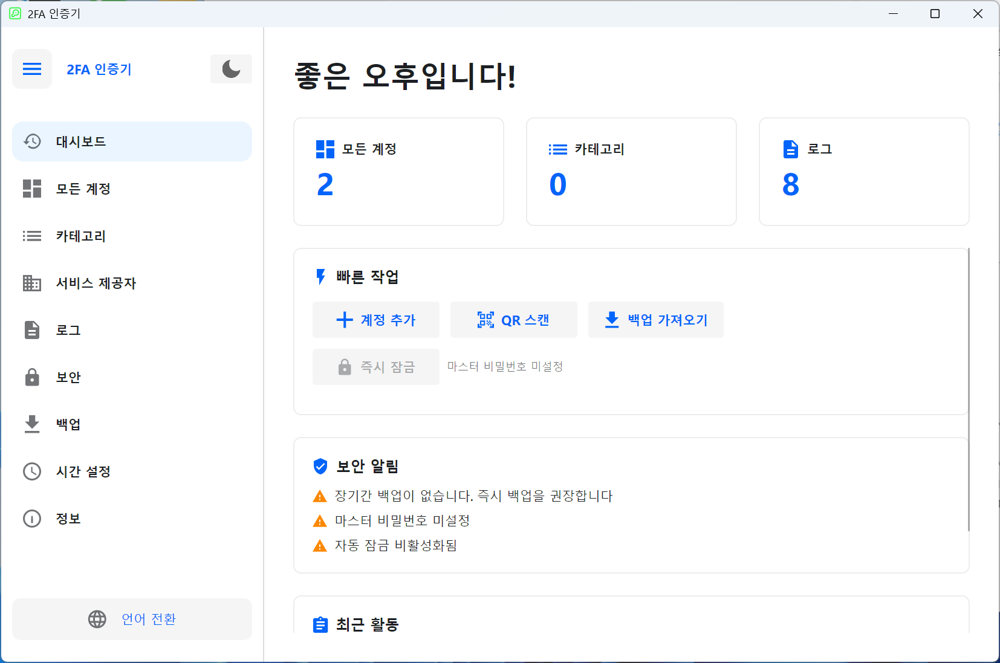

# 🔐 2FA Desktop — 크로스 플랫폼 이중 인증 데스크톱 클라이언트

[Avalonia UI](https://avaloniaui.net/)로 구축된 오픈소스 데스크톱 이중 인증(2FA) 관리자입니다. TOTP / HOTP 프로토콜을 지원하며 **Windows**와 **Linux** 모두 호환됩니다.

**[简体中文](README.zh-CN.md)** | **[English](README.en-US.md)** | **[Deutsch](README.de-DE.md)** | **[Español](README.es-ES.md)** | **[Français](README.fr-FR.md)** | **[日本語](README.ja-JP.md)** | **한국어** | **[Русский](README.ru-RU.md)**

---

## 📸 스크린샷

<div align="center">

</div>

---

## ✨ 기능

### 🔑 계정 관리
- **TOTP**(시간 기반) 및 **HOTP**(카운터 기반) OTP 유형 지원
- 세 가지 추가 방법: **수동 입력**, **URL 가져오기**(`otpauth://` 프로토콜), **QR 코드 일괄 가져오기**
- **Google Authenticator**에서 일괄 마이그레이션 (Google Protobuf 프로토콜 파싱)
- 사용자 정의 자릿수(6-8자리) 및 갱신 주기(30-60초)
- 실시간 카운트다운 표시, 원클릭 클립보드 복사
- 계정 고정/즐겨찾기, 검색 및 필터, 카테고리 필터링
- 그리드 뷰 / 리스트 뷰 전환
- 다중 선택 모드: 일괄 삭제, 일괄 고정, 일괄 카테고리 이동
- 계정 내보내기: QR 코드 이미지 및 `otpauth://` URL 형식, 단일 또는 일괄 내보내기

### 📂 카테고리 관리
- 카테고리 생성, 이름 변경, 삭제 (설명/메모 지원)
- 이름 또는 계정 수로 정렬
- 드래그 앤 드롭 재정렬
- 다중 선택 병합: 여러 카테고리의 계정을 대상 카테고리로 병합
- 카테고리 상세 보기 (계정 수, 설명, 정렬 순서)

### 🏢 서비스 제공자 템플릿
- 일반 제공자용 내장 아이콘 및 색상 (Google, GitHub, Microsoft 등)
- 사용자 정의 제공자: SVG 아이콘 업로드, 아이콘 색상 설정
- 계정 추가 시 빠른 템플릿 선택, 아이콘 자동 채우기
- 이름 또는 사용 횟수로 정렬, 검색 및 필터

### 🔒 보안
- **마스터 비밀번호 보호**: BCrypt 해시 저장, AES-GCM 암호화된 계정 시크릿
- **앱 잠금**: 시작 시 마스터 비밀번호 필요
- **유휴 자동 잠금**: 1/2/5/10/15/30분 (Windows는 전역 유휴 감지 지원)
- **스크린샷 차단**: Windows 10 2004+에서 시스템 수준 스크린샷/녹화 보호 (스크린샷이 검은 화면으로 표시)
- **클립보드 자동 지우기**: OTP 복사 후 자동 지우기 (5/10/30/60초)
- **세션 암호화**: 런타임 세션 키로 민감한 데이터 암호화
- **보안 알림 패널**: 현재 보안 상태를 시각적으로 표시

### 💾 백업 및 복원
- 암호화된 백업 파일로 내보내기 (`.2fabackup` 형식)
- **AES-GCM** 암호화 + **HMAC-SHA256** 서명 (변조 검증 포함)
- **PBKDF2** 키 파생 (200,000회 반복)
- 앱 설정 및 작업 로그 선택적 포함
- 두 가지 가져오기 모드:
  - **병합 모드** (권장): 기존 데이터 유지, 새 데이터 추가
  - **덮어쓰기 모드**: 기존 데이터 삭제, 완전 교체
- 충돌 전략: 중복 건너뛰기 / 기존 덮어쓰기 / 둘 다 유지 (이름 변경)
- 데이터 통계 패널: 계정 수, 카테고리 수, 마지막 백업 시간

### ⏱ 시간 설정
- **시스템 시간** 및 **NTP 네트워크 시간** 소스
- 내장 NTP 서버: Windows Time, Alibaba Cloud, Tencent Cloud, Google, Cloudflare
- 사용자 정의 NTP 서버 지원
- NTP 연결 테스트: 네트워크 시간 및 시간 편차 표시
- TOTP 코드 생성 정확도 보장

### 📋 작업 로그
- 완전한 감사 추적 (계정 추가/업데이트/삭제, 가져오기/내보내기, 설정 변경 등)
- 페이지네이션, 다중 선택 삭제, 전체 로그 지우기
- CSV로 로그 내보내기
- 원시 로그 형식 전환 (디버깅 및 분석용)
- 현지화된 로그 콘텐츠 표시

### 🎨 UI 및 개인화
- **라이트/다크 테마** 전환
- **첫 실행 마법사**: 언어 및 테마 선택
- **사이드바 내비게이션**: 접기/펼치기 가능
- **대시보드**: 빠른 작업, 보안 알림, 최근 활동, 데이터 통계
- 시간대별 인사말 (좋은 아침/오후/저녁)

### 🌍 다국어 지원

| 언어 | 코드 |
|------|------|
| 🇨🇳 简体中文 | `zh-CN` |
| 🇺🇸 English | `en-US` |
| 🇩🇪 Deutsch | `de-DE` |
| 🇪🇸 Español | `es-ES` |
| 🇫🇷 Français | `fr-FR` |
| 🇯🇵 日本語 | `ja-JP` |
| 🇰🇷 한국어 | `ko-KR` |
| 🇷🇺 Русский | `ru-RU` |

---

## 🛠 기술 스택

| 구성 요소 | 기술 | 버전 |
|----------|------|------|
| 런타임 | .NET | 8.0 |
| UI 프레임워크 | Avalonia UI | 11.3.11 |
| 테마 라이브러리 | Semi.Avalonia | 11.3.7.2 |
| 데이터베이스 | SQLite (Microsoft.Data.Sqlite) | 10.0.2 |
| 비밀번호 해싱 | BCrypt.Net-Next | 4.0.3 |
| QR 코드 | ZXing.Net + SkiaSharp | 0.16.11 |
| SVG 렌더링 | Svg.Skia | 3.4.1 |
| 그래픽 | SkiaSharp | 3.119.1 |
| Protobuf | Google.Protobuf | 3.28.3 |
| DI | Microsoft.Extensions.DependencyInjection | 10.0.2 |
| 컴파일 | Native AOT | — |

### 아키텍처
- **MVVM 패턴**: ViewModel + ObservableObject 데이터 바인딩
- **의존성 주입**: Microsoft.Extensions.DependencyInjection 컨테이너
- **리포지토리 패턴**: 데이터 계층 추상화
- **서비스 계층**: 비즈니스 로직과 UI 분리
- **완전 비동기**: async/await로 UI 응답성 보장

---

## 🚀 빠른 시작

### Microsoft Store에서 설치

<a href="https://apps.microsoft.com/detail/9P178R1MVM9T?referrer=appbadge&mode=full" target="_blank" rel="noopener noreferrer"></a>

### 요구 사항

- [.NET 8 SDK](https://dotnet.microsoft.com/download/dotnet/8.0)
- Windows 10+ 또는 Linux (Ubuntu 20.04+, Debian 11+ 등)

### 클론

```bash
git clone https://github.com/salokrwhite/2fa-desktop.git
cd 2fa-desktop
```

### Windows 빌드 및 실행

```bash
dotnet run
# 릴리스 (Native AOT)
dotnet publish -c Release -r win-x64 --self-contained true -p:PublishAot=true
```

### Linux 빌드 및 실행

```bash
cd linux-desktop
dotnet run
# 릴리스 (Native AOT)
dotnet publish -c Release -r linux-x64 --self-contained true -p:PublishAot=true
```

### Linux .deb 패키지

```bash
chmod +x linux-desktop/build-deb.sh
./linux-desktop/build-deb.sh
sudo apt install ./bin/deb-staging/twofactorauth-desktop_1.0.0_amd64.deb
```

---

## 📁 프로젝트 구조

```
2fa-desktop/
├── App.axaml / App.axaml.cs          # 앱 진입점, 테마 및 언어 설정
├── TwoFactorAuthDesktop.csproj       # Windows 프로젝트 파일
├── Program.cs                        # 진입점
│
├── Models/                           # 데이터 모델
│   ├── Account.cs                    # 2FA 계정 모델 (TOTP/HOTP)
│   ├── Category.cs                   # 카테고리 모델
│   ├── Settings.cs                   # 설정 모델
│   ├── BackupData.cs                 # 백업 데이터 구조
│   ├── ServiceProvider.cs            # 서비스 제공자 템플릿 모델
│   ├── OperationLog.cs               # 작업 로그 모델
│   └── ObservableObject.cs           # MVVM Observable 기본 클래스
│
├── ViewModels/                       # ViewModel 계층
│   ├── MainViewModel.cs              # 메인 윈도우 (내비게이션, 테마, 언어)
│   ├── DashboardViewModel.cs         # 대시보드 (빠른 작업, 보안 알림)
│   ├── AccountListViewModel.cs       # 계정 목록 (검색, 필터, 다중 선택)
│   ├── AccountItemViewModel.cs       # 단일 계정 항목 (OTP 표시, 카운트다운)
│   ├── AddAccountViewModel.cs        # 계정 추가 (수동/URL/QR)
│   ├── CategoryListViewModel.cs      # 카테고리 관리
│   ├── ServiceProviderListViewModel.cs # 서비스 제공자 관리
│   ├── OperationLogViewModel.cs      # 작업 로그
│   ├── SecuritySettingsViewModel.cs  # 보안 설정
│   ├── BackupViewModel.cs            # 백업 및 복원
│   ├── TimeSettingsViewModel.cs      # 시간 설정
│   ├── ExportAccountViewModel.cs     # 계정 내보내기
│   ├── LockScreenViewModel.cs        # 잠금 화면
│   └── ...                           # 기타 다이얼로그 ViewModel
│
├── Views/                            # 뷰 계층 (AXAML)
│   ├── MainWindow.axaml              # 메인 윈도우 (사이드바 + 콘텐츠)
│   ├── BackupView.axaml              # 백업 및 복원 페이지
│   ├── LockScreenView.axaml          # 잠금 화면 페이지
│   ├── TimeSettingsView.axaml        # 시간 설정 페이지
│   ├── Dialogs/                      # 다이얼로그 (17개)
│   │   ├── UnifiedAddAccountDialog   # 통합 계정 추가 다이얼로그
│   │   ├── QrImportDialog            # QR 코드 일괄 가져오기
│   │   ├── ExportBackupDialog        # 백업 내보내기
│   │   ├── ImportBackupDialog        # 백업 가져오기
│   │   ├── ExportAccountDialog       # 계정 내보내기
│   │   ├── PasswordDialog            # 비밀번호 입력
│   │   ├── SetPasswordDialog         # 비밀번호 설정
│   │   └── ...                       # 기타 다이얼로그
│   └── Wizard/                       # 첫 실행 마법사
│       ├── SetupWizardView           # 마법사 컨테이너
│       ├── WizardLanguageView        # 언어 선택 단계
│       └── WizardThemeView           # 테마 선택 단계
│
├── Services/                         # 서비스 계층
│   ├── OtpService.cs                 # OTP 생성 (TOTP/HOTP)
│   ├── SecurityService.cs            # 보안 (암호화/복호화/비밀번호)
│   ├── BackupService.cs              # 백업 (내보내기/가져오기/암호화)
│   ├── AccountService.cs             # 계정 CRUD
│   ├── StorageService.cs             # 스토리지 (시크릿 로테이션)
│   ├── AutoLockManager.cs            # 자동 잠금 관리
│   ├── AppLockCoordinator.cs         # 앱 잠금 코디네이터
│   ├── ClipboardClearService.cs      # 클립보드 지우기 서비스
│   ├── ScreenshotProtectionService.cs # 스크린샷 보호 (Windows API)
│   ├── NtpTimeProvider.cs            # NTP 시간 제공자
│   ├── TimeService.cs                # 시간 서비스
│   └── ...                           # 인터페이스 및 기타 구현
│
├── Data/                             # 데이터 접근 계층
│   ├── DatabaseContext.cs            # SQLite 컨텍스트 (스키마/마이그레이션)
│   ├── AccountRepository.cs          # 계정 리포지토리
│   ├── CategoryRepository.cs         # 카테고리 리포지토리
│   ├── SettingsRepository.cs         # 설정 리포지토리
│   ├── OperationLogRepository.cs     # 작업 로그 리포지토리
│   ├── ServiceProviderRepository.cs  # 서비스 제공자 리포지토리
│   ├── BuiltInServiceProviders.cs    # 내장 제공자 데이터
│   └── SettingKeys.cs                # 설정 키 상수
│
├── Utils/                            # 유틸리티
│   ├── TotpGenerator.cs              # TOTP 알고리즘
│   ├── HotpGenerator.cs              # HOTP 알고리즘 (HMAC-SHA1)
│   ├── Base32.cs                     # Base32 인코딩/디코딩
│   ├── OtpUriParser.cs               # otpauth:// URI 파서
│   ├── OtpUrlGenerator.cs            # OTP URL 생성기
│   ├── QrCodeGenerator.cs            # QR 코드 생성 (ZXing + SkiaSharp)
│   ├── QrCodeDecoder.cs              # QR 코드 디코딩
│   ├── GoogleAuthMigrationParser.cs  # Google Authenticator 마이그레이션 파서
│   ├── SvgParser.cs / SvgImageHelper.cs # SVG 아이콘 처리
│   └── ...                           # 기타 유틸리티
│
├── Converters/                       # XAML 값 변환기
├── Controls/                         # 사용자 정의 컨트롤 (카운트다운 파이)
├── Assets/Lang/                      # 다국어 리소스 파일 (8개 언어)
│
├── linux-desktop/                    # Linux 전용 프로젝트
│   ├── TwoFactorAuthDesktop.csproj   # Linux 프로젝트 파일
│   ├── build-deb.sh                  # Debian 패키징 스크립트
│   ├── app.png                       # Linux 앱 아이콘
│   └── ...                           # 메인 프로젝트와 동일한 구조
│
└── picture/                          # README 스크린샷
    ├── zh-CN.png
    ├── en-US.png
    └── ...                           # 각 언어별 스크린샷
```

---

## 🔐 보안 아키텍처

| 보안 계층 | 기술 방안 |
|-----------|-----------|
| 비밀번호 저장 | BCrypt 해시 (자동 솔트) |
| 키 파생 | PBKDF2 (100,000-200,000회 반복) |
| 데이터 암호화 | AES-GCM (256비트) |
| 서명 | HMAC-SHA256 |
| OTP 알고리즘 | HMAC-SHA1 (RFC 4226 / RFC 6238) |

- **마스터 비밀번호 없음**: 로컬 SQLite에 평문 저장, 개인 기기에 적합
- **마스터 비밀번호 있음**: 모든 계정 시크릿을 마스터 비밀번호 파생 키로 암호화
- **백업 암호화**: 독립적인 백업 비밀번호, PBKDF2 + AES-GCM + HMAC
- **오프라인 우선**: 모든 데이터를 로컬에 저장, 클라우드 동기화 없음

---

## 🤝 기여

Issue와 Pull Request를 환영합니다.

1. 이 저장소를 포크
2. 기능 브랜치 생성: `git checkout -b feature/your-feature`
3. 변경 사항 커밋: `git commit -m "Add your feature"`
4. 푸시: `git push origin feature/your-feature`
5. Pull Request 제출

---

## 📄 라이선스

이 프로젝트는 [MIT License](LICENSE) 하에 라이선스됩니다.

Copyright © 2026 lijicheng

---

이 프로젝트가 도움이 되셨다면 ⭐ 스타를 눌러주세요!

[GitHub 저장소](https://github.com/salokrwhite/2fa-desktop)
