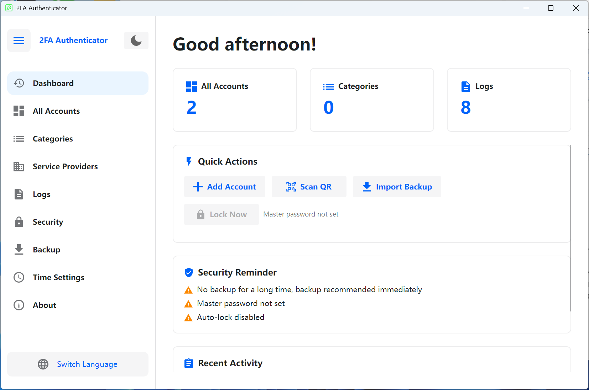

# 🔐 2FA Desktop — Cross-Platform Two-Factor Authentication Desktop Client

An open-source desktop two-factor authentication (2FA) manager built with [Avalonia UI](https://avaloniaui.net/), supporting TOTP / HOTP protocols, compatible with both **Windows** and **Linux**.

**[简体中文](README.zh-CN.md)** | **English** | **[Deutsch](README.de-DE.md)** | **[Español](README.es-ES.md)** | **[Français](README.fr-FR.md)** | **[日本語](README.ja-JP.md)** | **[한국어](README.ko-KR.md)** | **[Русский](README.ru-RU.md)**

---

## 📸 Screenshots

<div align="center">

</div>

---

## ✨ Features

### 🔑 Account Management
- Supports both **TOTP** (time-based) and **HOTP** (counter-based) OTP types
- Three ways to add accounts: **Manual input**, **URL import** (`otpauth://` protocol), **QR code batch import**
- Batch migration from **Google Authenticator** (Google Protobuf protocol parsing)
- Customizable digits (6-8) and refresh period (30-60 seconds)
- Real-time countdown display, one-click copy to clipboard
- Pin/favorite accounts, search & filter, category filtering
- Grid view / List view toggle
- Multi-select mode: batch delete, batch pin, batch move to category
- Account export: QR code image and `otpauth://` URL formats, single or batch export

### 📂 Category Management
- Create, rename, delete categories with description/notes support
- Sort by name or account count
- Drag-and-drop reordering
- Multi-select merge: merge accounts from multiple categories into a target category
- Category details view (account count, description, sort order)

### 🏢 Service Provider Templates
- Built-in icons and colors for common providers (Google, GitHub, Microsoft, etc.)
- Custom service providers: upload SVG icons, set icon colors
- Quick template selection when adding accounts, auto-fill icons
- Sort by name or usage count, search & filter

### 🔒 Security
- **Master password protection**: BCrypt hash storage, AES-GCM encrypted account secrets
- **App lock**: Requires master password to unlock on startup
- **Idle auto-lock**: 1/2/5/10/15/30 minutes (Windows supports global idle detection)
- **Screenshot blocking**: System-level screenshot/recording protection on Windows 10 2004+ (screenshots show black screen)
- **Clipboard auto-clear**: Automatically clears clipboard after copying OTP (5/10/30/60 seconds)
- **Session encryption**: Runtime session key encryption for sensitive data
- **Security notice panel**: Visual display of current security status and recommendations

### 💾 Backup & Restore
- Export as encrypted backup files (`.2fabackup` format)
- **AES-GCM** encryption + **HMAC-SHA256** signature with tamper verification
- Key derivation using **PBKDF2** (200,000 iterations)
- Optional inclusion of app settings and operation logs
- Two import modes:
  - **Merge mode** (recommended): Keep existing data, add new data
  - **Overwrite mode**: Clear existing data, fully replace
- Conflict strategies: Skip duplicates / Overwrite existing / Keep both (rename)
- Data statistics panel: account count, category count, last backup time

### ⏱ Time Settings
- **System time** and **NTP network time** sources
- Built-in NTP servers: Windows Time, Alibaba Cloud, Tencent Cloud, Google, Cloudflare
- Custom NTP server support
- NTP connection test: displays network time and time offset
- Ensures TOTP code generation accuracy

### 📋 Operation Logs
- Complete audit trail (add/update/delete accounts, import/export, settings changes, etc.)
- Pagination, multi-select delete, clear all logs
- Export logs to CSV
- Raw log format toggle (for debugging and analysis)
- Localized log content display

### 🎨 UI & Personalization
- **Light/Dark theme** toggle
- **First-launch wizard**: language and theme selection
- **Sidebar navigation**: collapsible/expandable
- **Dashboard**: quick actions, security reminders, recent activity, data statistics
- Time-based greetings (Good morning/afternoon/evening)

### 🌍 Multi-language Support

| Language | Code |
|----------|------|
| 🇨🇳 简体中文 | `zh-CN` |
| 🇺🇸 English | `en-US` |
| 🇩🇪 Deutsch | `de-DE` |
| 🇪🇸 Español | `es-ES` |
| 🇫🇷 Français | `fr-FR` |
| 🇯🇵 日本語 | `ja-JP` |
| 🇰🇷 한국어 | `ko-KR` |
| 🇷🇺 Русский | `ru-RU` |

---

## 🛠 Tech Stack

| Component | Technology | Version |
|-----------|-----------|---------|
| Runtime | .NET | 8.0 |
| UI Framework | Avalonia UI | 11.3.11 |
| Theme Library | Semi.Avalonia | 11.3.7.2 |
| Database | SQLite (Microsoft.Data.Sqlite) | 10.0.2 |
| Password Hashing | BCrypt.Net-Next | 4.0.3 |
| QR Code | ZXing.Net + SkiaSharp | 0.16.11 |
| SVG Rendering | Svg.Skia | 3.4.1 |
| Graphics | SkiaSharp | 3.119.1 |
| Protobuf | Google.Protobuf | 3.28.3 |
| DI | Microsoft.Extensions.DependencyInjection | 10.0.2 |
| Compilation | Native AOT | — |

### Architecture
- **MVVM pattern**: ViewModel + ObservableObject data binding
- **Dependency Injection**: Microsoft.Extensions.DependencyInjection container
- **Repository pattern**: Data layer abstraction
- **Service layer**: Business logic decoupled from UI
- **Fully async**: async/await for UI responsiveness

---

## 📦 Database Structure

The app uses a local SQLite database stored at:

```
# Windows
%LOCALAPPDATA%\TwoFactorAuth-Desktop\TwoFactorAuth.db

# Linux
~/.local/share/TwoFactorAuth-Desktop/TwoFactorAuth.db
```

Tables:

| Table | Description |
|-------|-------------|
| `Accounts` | 2FA account data (name, issuer, secret, type, digits, period, etc.) |
| `Categories` | Category info (name, description, sort order) |
| `Settings` | Key-value configuration store |
| `OperationLogs` | Operation audit logs |
| `ServiceProviders` | Service provider templates (icons, colors) |

---

## 🚀 Quick Start

### Install from Microsoft Store

<a href="https://apps.microsoft.com/detail/9P178R1MVM9T?referrer=appbadge&mode=full" target="_blank" rel="noopener noreferrer"></a>

### Requirements

- [.NET 8 SDK](https://dotnet.microsoft.com/download/dotnet/8.0)
- Windows 10+ or Linux (Ubuntu 20.04+, Debian 11+, etc.)

### Clone

```bash
git clone https://github.com/salokrwhite/2fa-desktop.git
cd 2fa-desktop
```

### Windows Build & Run

```bash
# Development
dotnet run

# Release (Native AOT)
dotnet publish -c Release -r win-x64 --self-contained true -p:PublishAot=true
```

Published executable is in `bin/Release/net8.0/win-x64/publish/`.

### Linux Build & Run

Linux version is in the `linux-desktop/` directory:

```bash
cd linux-desktop

# Development
dotnet run

# Release (Native AOT)
dotnet publish -c Release -r linux-x64 --self-contained true -p:PublishAot=true
```

### Linux .deb Package

The project provides a one-click packaging script `linux-desktop/build-deb.sh`, supporting both WSL and native Linux:

```bash
# Basic usage (default config)
chmod +x linux-desktop/build-deb.sh
./linux-desktop/build-deb.sh

# Custom parameters
PKG_NAME=twofactorauth-desktop \
APP_VERSION=1.0.0 \
MAINTAINER="Your Name <you@example.com>" \
./linux-desktop/build-deb.sh
```

#### Environment Variables

| Variable | Default | Description |
|----------|---------|-------------|
| `PKG_NAME` | `twofactorauth-desktop` | Debian package name |
| `APP_VERSION` | `1.0.0` | Version number |
| `APP_DISPLAY_NAME` | `TwoFactorAuth Desktop` | Display name |
| `ARCH` | `amd64` | Target architecture |
| `RUNTIME` | `linux-x64` | .NET runtime identifier |
| `ENTRY_EXE_NAME` | `TwoFactorAuthDesktop` | Executable name |
| `MAINTAINER` | `Your Name <you@example.com>` | Maintainer info |
| `DEPS` | `libx11-6, libice6, ...` | Runtime dependencies |
| `ICON_PNG_PATH` | `app.png` | PNG icon path |
| `ICON_ICO_PATH` | `app.ico` | ICO icon path |

#### Packaging Process

1. **Check build dependencies**: Auto-installs `clang`, `zlib1g-dev`, `dpkg-dev`
2. **NativeAOT publish**: Compiles to a standalone native executable
3. **Build .deb structure**:
   - Installs to `/opt/twofactorauth-desktop/`
   - Creates `/usr/bin/` symlink
   - Generates `.desktop` entry file
   - Generates AppStream metadata (`metainfo.xml`)
   - Installs app icon to `hicolor` icon theme
4. **Generate .deb package**: Output to `bin/deb-staging/`

#### Install .deb

```bash
sudo apt install ./bin/deb-staging/twofactorauth-desktop_1.0.0_amd64.deb
```

After installation:
- Terminal: `twofactorauth-desktop`
- App menu: Find **TwoFactorAuth Desktop** under "Utilities" or "Security"

---

## 📁 Project Structure

```
2fa-desktop/
├── App.axaml / App.axaml.cs          # App entry, theme & language config
├── TwoFactorAuthDesktop.csproj       # Windows project file
├── Program.cs                        # Entry point
│
├── Models/                           # Data models
│   ├── Account.cs                    # 2FA account model (TOTP/HOTP)
│   ├── Category.cs                   # Category model
│   ├── Settings.cs                   # Settings model
│   ├── BackupData.cs                 # Backup data structures
│   ├── ServiceProvider.cs            # Service provider template model
│   ├── OperationLog.cs               # Operation log model
│   └── ObservableObject.cs           # MVVM observable base class
│
├── ViewModels/                       # ViewModel layer
│   ├── MainViewModel.cs              # Main window (navigation, theme, language)
│   ├── DashboardViewModel.cs         # Dashboard (quick actions, security reminders)
│   ├── AccountListViewModel.cs       # Account list (search, filter, multi-select)
│   ├── AccountItemViewModel.cs       # Single account item (OTP display, countdown)
│   ├── AddAccountViewModel.cs        # Add account (manual/URL/QR)
│   ├── CategoryListViewModel.cs      # Category management
│   ├── ServiceProviderListViewModel.cs # Service provider management
│   ├── OperationLogViewModel.cs      # Operation logs
│   ├── SecuritySettingsViewModel.cs  # Security settings
│   ├── BackupViewModel.cs            # Backup & restore
│   ├── TimeSettingsViewModel.cs      # Time settings
│   ├── ExportAccountViewModel.cs     # Account export
│   ├── LockScreenViewModel.cs        # Lock screen
│   └── ...                           # Other dialog ViewModels
│
├── Views/                            # View layer (AXAML)
│   ├── MainWindow.axaml              # Main window (sidebar + content)
│   ├── BackupView.axaml              # Backup & restore page
│   ├── LockScreenView.axaml          # Lock screen page
│   ├── TimeSettingsView.axaml        # Time settings page
│   ├── Dialogs/                      # Dialogs (17)
│   │   ├── UnifiedAddAccountDialog   # Unified add account dialog
│   │   ├── QrImportDialog            # QR code batch import
│   │   ├── ExportBackupDialog        # Export backup
│   │   ├── ImportBackupDialog        # Import backup
│   │   ├── ExportAccountDialog       # Export account
│   │   ├── PasswordDialog            # Password input
│   │   ├── SetPasswordDialog         # Set password
│   │   └── ...                       # Other dialogs
│   └── Wizard/                       # First-launch wizard
│       ├── SetupWizardView           # Wizard container
│       ├── WizardLanguageView        # Language selection step
│       └── WizardThemeView           # Theme selection step
│
├── Services/                         # Service layer
│   ├── OtpService.cs                 # OTP generation (TOTP/HOTP)
│   ├── SecurityService.cs            # Security (encrypt/decrypt/password)
│   ├── BackupService.cs              # Backup (export/import/encrypt)
│   ├── AccountService.cs             # Account CRUD
│   ├── StorageService.cs             # Storage (secret rotation)
│   ├── AutoLockManager.cs            # Auto-lock management
│   ├── AppLockCoordinator.cs         # App lock coordinator
│   ├── ClipboardClearService.cs      # Clipboard clear service
│   ├── ScreenshotProtectionService.cs # Screenshot protection (Windows API)
│   ├── NtpTimeProvider.cs            # NTP time provider
│   ├── TimeService.cs                # Time service
│   └── ...                           # Interfaces and other implementations
│
├── Data/                             # Data access layer
│   ├── DatabaseContext.cs            # SQLite context (schema/migration)
│   ├── AccountRepository.cs          # Account repository
│   ├── CategoryRepository.cs         # Category repository
│   ├── SettingsRepository.cs         # Settings repository
│   ├── OperationLogRepository.cs     # Operation log repository
│   ├── ServiceProviderRepository.cs  # Service provider repository
│   ├── BuiltInServiceProviders.cs    # Built-in provider data
│   └── SettingKeys.cs                # Setting key constants
│
├── Utils/                            # Utilities
│   ├── TotpGenerator.cs              # TOTP algorithm
│   ├── HotpGenerator.cs              # HOTP algorithm (HMAC-SHA1)
│   ├── Base32.cs                     # Base32 encoding/decoding
│   ├── OtpUriParser.cs               # otpauth:// URI parser
│   ├── OtpUrlGenerator.cs            # OTP URL generator
│   ├── QrCodeGenerator.cs            # QR code generation (ZXing + SkiaSharp)
│   ├── QrCodeDecoder.cs              # QR code decoding
│   ├── GoogleAuthMigrationParser.cs  # Google Authenticator migration parser
│   ├── SvgParser.cs / SvgImageHelper.cs # SVG icon processing
│   └── ...                           # Other utilities
│
├── Converters/                       # XAML value converters
├── Controls/                         # Custom controls (countdown pie)
├── Assets/Lang/                      # Multi-language resource files (8 languages)
│
├── linux-desktop/                    # Linux-specific project
│   ├── TwoFactorAuthDesktop.csproj   # Linux project file
│   ├── build-deb.sh                  # Debian packaging script
│   ├── app.png                       # Linux app icon
│   └── ...                           # Same structure as main project
│
└── picture/                          # README screenshots
    ├── zh-CN.png
    ├── en-US.png
    └── ...                           # Screenshots for each language
```

---

## 🔐 Security Architecture

### Encryption Scheme

| Security Layer | Technology |
|----------------|------------|
| Password Storage | BCrypt hash (auto-salted) |
| Key Derivation | PBKDF2 (100,000-200,000 iter.) |
| Data Encryption | AES-GCM (256-bit) |
| Signature | HMAC-SHA256 |
| OTP Algorithm | HMAC-SHA1 (RFC 4226 / RFC 6238) |

### Security Details

- **No master password**: Data stored in plaintext in local SQLite, suitable for personal devices
- **With master password**: All account secrets encrypted with master-password-derived key; database theft won't expose secrets
- **Backup encryption**: Independent backup password, PBKDF2 key derivation + AES-GCM encryption + HMAC signature
- **Offline-first**: All data stored locally, no cloud sync, no network dependency (except optional NTP)

---

## 🤝 Contributing

Issues and Pull Requests are welcome.

1. Fork this repository
2. Create a feature branch: `git checkout -b feature/your-feature`
3. Commit changes: `git commit -m "Add your feature"`
4. Push: `git push origin feature/your-feature`
5. Submit a Pull Request

### Adding a New Language

1. Copy `Assets/Lang/en-US.axaml` as a new language file (e.g., `Assets/Lang/pt-BR.axaml`)
2. Translate all string values
3. Register the new language in `App.axaml.cs`
4. Sync update `linux-desktop/Assets/Lang/` directory

---

## 📄 License

This project is licensed under the [MIT License](LICENSE).

Copyright © 2026 lijicheng

---

If this project helps you, please give it a ⭐ Star!

[GitHub Repository](https://github.com/salokrwhite/2fa-desktop)
