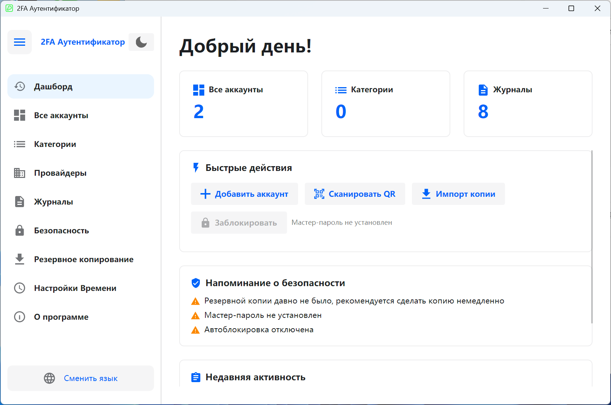

# 🔐 2FA Desktop — Кроссплатформенный десктопный клиент двухфакторной аутентификации

Десктопный менеджер двухфакторной аутентификации (2FA) с открытым исходным кодом, созданный на [Avalonia UI](https://avaloniaui.net/), поддерживающий протоколы TOTP / HOTP, совместимый с **Windows** и **Linux**.

**[简体中文](README.zh-CN.md)** | **[English](README.en-US.md)** | **[Deutsch](README.de-DE.md)** | **[Español](README.es-ES.md)** | **[Français](README.fr-FR.md)** | **[日本語](README.ja-JP.md)** | **[한국어](README.ko-KR.md)** | **Русский**

---

## 📸 Скриншоты

<div align="center">

</div>

---

## ✨ Возможности

### 🔑 Управление аккаунтами
- Поддержка типов OTP **TOTP** (на основе времени) и **HOTP** (на основе счётчика)
- Три способа добавления: **Ручной ввод**, **Импорт URL** (протокол `otpauth://`), **Пакетный импорт QR-кодов**
- Пакетная миграция из **Google Authenticator** (парсинг протокола Google Protobuf)
- Настраиваемое количество цифр (6-8) и период обновления (30-60 секунд)
- Отображение обратного отсчёта в реальном времени, копирование в буфер обмена одним кликом
- Закрепление/избранное аккаунтов, поиск и фильтрация, фильтрация по категориям
- Переключение между сеткой и списком
- Режим множественного выбора: пакетное удаление, закрепление, перемещение в категорию
- Экспорт аккаунтов: форматы QR-код и `otpauth://` URL, одиночный или пакетный экспорт

### 📂 Управление категориями
- Создание, переименование, удаление категорий с описанием/заметками
- Сортировка по имени или количеству аккаунтов
- Перетаскивание для изменения порядка
- Множественное объединение: объединение аккаунтов из нескольких категорий в целевую
- Просмотр деталей категории (количество аккаунтов, описание, порядок сортировки)

### 🏢 Шаблоны поставщиков услуг
- Встроенные иконки и цвета для популярных провайдеров (Google, GitHub, Microsoft и др.)
- Пользовательские провайдеры: загрузка SVG-иконок, настройка цветов
- Быстрый выбор шаблона при добавлении аккаунтов, автозаполнение иконок
- Сортировка по имени или частоте использования, поиск и фильтрация

### 🔒 Безопасность
- **Защита мастер-паролем**: хранение BCrypt-хэша, шифрование секретов AES-GCM
- **Блокировка приложения**: требуется мастер-пароль при запуске
- **Автоблокировка при бездействии**: 1/2/5/10/15/30 минут (Windows поддерживает глобальное обнаружение бездействия)
- **Блокировка скриншотов**: системная защита от скриншотов/записи на Windows 10 2004+ (скриншоты показывают чёрный экран)
- **Автоочистка буфера обмена**: автоматическая очистка после копирования OTP (5/10/30/60 секунд)
- **Сессионное шифрование**: сессионный ключ для конфиденциальных данных
- **Панель уведомлений безопасности**: визуальное отображение текущего состояния безопасности

### 💾 Резервное копирование и восстановление
- Экспорт в зашифрованные файлы резервных копий (формат `.2fabackup`)
- Шифрование **AES-GCM** + подпись **HMAC-SHA256** с проверкой целостности
- Вывод ключа **PBKDF2** (200 000 итераций)
- Опциональное включение настроек и журналов операций
- Два режима импорта:
  - **Режим слияния** (рекомендуется): сохранить существующие данные, добавить новые
  - **Режим перезаписи**: очистить существующие данные, полностью заменить
- Стратегии конфликтов: пропустить дубликаты / перезаписать / сохранить оба (переименовать)
- Панель статистики: количество аккаунтов, категорий, время последнего бэкапа

### ⏱ Настройки времени
- Источники времени: **системное время** и **NTP сетевое время**
- Встроенные NTP-серверы: Windows Time, Alibaba Cloud, Tencent Cloud, Google, Cloudflare
- Поддержка пользовательских NTP-серверов
- Тест NTP-соединения: отображение сетевого времени и отклонения
- Обеспечение точности генерации TOTP-кодов

### 📋 Журналы операций
- Полный аудит (добавление/обновление/удаление аккаунтов, импорт/экспорт, изменения настроек и т.д.)
- Пагинация, множественное удаление, очистка всех журналов
- Экспорт журналов в CSV
- Переключение формата необработанных журналов (для отладки и анализа)
- Локализованное отображение содержимого журналов

### 🎨 Интерфейс и персонализация
- Переключение **светлой/тёмной темы**
- **Мастер первого запуска**: выбор языка и темы
- **Боковая навигация**: сворачиваемая/разворачиваемая
- **Панель управления**: быстрые действия, напоминания безопасности, недавняя активность, статистика
- Приветствия по времени суток (Доброе утро/день/вечер)

### 🌍 Многоязычная поддержка

| Язык | Код |
|------|-----|
| 🇨🇳 简体中文 | `zh-CN` |
| 🇺🇸 English | `en-US` |
| 🇩🇪 Deutsch | `de-DE` |
| 🇪🇸 Español | `es-ES` |
| 🇫🇷 Français | `fr-FR` |
| 🇯🇵 日本語 | `ja-JP` |
| 🇰🇷 한국어 | `ko-KR` |
| 🇷🇺 Русский | `ru-RU` |

---

## 🛠 Технологический стек

| Компонент | Технология | Версия |
|-----------|-----------|--------|
| Среда выполнения | .NET | 8.0 |
| UI-фреймворк | Avalonia UI | 11.3.11 |
| Библиотека тем | Semi.Avalonia | 11.3.7.2 |
| База данных | SQLite (Microsoft.Data.Sqlite) | 10.0.2 |
| Хэширование паролей | BCrypt.Net-Next | 4.0.3 |
| QR-код | ZXing.Net + SkiaSharp | 0.16.11 |
| SVG-рендеринг | Svg.Skia | 3.4.1 |
| Графика | SkiaSharp | 3.119.1 |
| Protobuf | Google.Protobuf | 3.28.3 |
| DI | Microsoft.Extensions.DependencyInjection | 10.0.2 |
| Компиляция | Native AOT | — |

### Архитектура
- **Паттерн MVVM**: ViewModel + ObservableObject привязка данных
- **Внедрение зависимостей**: контейнер Microsoft.Extensions.DependencyInjection
- **Паттерн Repository**: абстракция уровня данных
- **Сервисный слой**: бизнес-логика отделена от UI
- **Полностью асинхронный**: async/await для отзывчивости UI

---

## 🚀 Быстрый старт

### Установить из Microsoft Store

<a href="https://apps.microsoft.com/detail/9P178R1MVM9T?referrer=appbadge&mode=full" target="_blank" rel="noopener noreferrer"></a>

### Требования

- [.NET 8 SDK](https://dotnet.microsoft.com/download/dotnet/8.0)
- Windows 10+ или Linux (Ubuntu 20.04+, Debian 11+ и т.д.)

### Клонирование

```bash
git clone https://github.com/salokrwhite/2fa-desktop.git
cd 2fa-desktop
```

### Windows сборка и запуск

```bash
dotnet run
# Релиз (Native AOT)
dotnet publish -c Release -r win-x64 --self-contained true -p:PublishAot=true
```

### Linux сборка и запуск

```bash
cd linux-desktop
dotnet run
# Релиз (Native AOT)
dotnet publish -c Release -r linux-x64 --self-contained true -p:PublishAot=true
```

### Linux .deb пакет

```bash
chmod +x linux-desktop/build-deb.sh
./linux-desktop/build-deb.sh
sudo apt install ./bin/deb-staging/twofactorauth-desktop_1.0.0_amd64.deb
```

---

## 📁 Структура проекта

```
2fa-desktop/
├── App.axaml / App.axaml.cs          # Точка входа, конфигурация темы и языка
├── TwoFactorAuthDesktop.csproj       # Файл проекта Windows
├── Program.cs                        # Точка входа
│
├── Models/                           # Модели данных
│   ├── Account.cs                    # Модель аккаунта 2FA (TOTP/HOTP)
│   ├── Category.cs                   # Модель категории
│   ├── Settings.cs                   # Модель настроек
│   ├── BackupData.cs                 # Структуры данных резервных копий
│   ├── ServiceProvider.cs            # Модель шаблона поставщика услуг
│   ├── OperationLog.cs               # Модель журнала операций
│   └── ObservableObject.cs           # Базовый класс MVVM Observable
│
├── ViewModels/                       # Слой ViewModel
│   ├── MainViewModel.cs              # Главное окно (навигация, тема, язык)
│   ├── DashboardViewModel.cs         # Панель управления (быстрые действия, безопасность)
│   ├── AccountListViewModel.cs       # Список аккаунтов (поиск, фильтр, множественный выбор)
│   ├── AccountItemViewModel.cs       # Элемент аккаунта (отображение OTP, обратный отсчёт)
│   ├── AddAccountViewModel.cs        # Добавление аккаунта (ручной/URL/QR)
│   ├── CategoryListViewModel.cs      # Управление категориями
│   ├── ServiceProviderListViewModel.cs # Управление поставщиками услуг
│   ├── OperationLogViewModel.cs      # Журналы операций
│   ├── SecuritySettingsViewModel.cs  # Настройки безопасности
│   ├── BackupViewModel.cs            # Резервное копирование и восстановление
│   ├── TimeSettingsViewModel.cs      # Настройки времени
│   ├── ExportAccountViewModel.cs     # Экспорт аккаунтов
│   ├── LockScreenViewModel.cs        # Экран блокировки
│   └── ...                           # Другие ViewModel диалогов
│
├── Views/                            # Слой представлений (AXAML)
│   ├── MainWindow.axaml              # Главное окно (боковая панель + контент)
│   ├── BackupView.axaml              # Страница резервного копирования
│   ├── LockScreenView.axaml          # Страница блокировки
│   ├── TimeSettingsView.axaml        # Страница настроек времени
│   ├── Dialogs/                      # Диалоги (17)
│   │   ├── UnifiedAddAccountDialog   # Единый диалог добавления аккаунта
│   │   ├── QrImportDialog            # Пакетный импорт QR-кодов
│   │   ├── ExportBackupDialog        # Экспорт резервной копии
│   │   ├── ImportBackupDialog        # Импорт резервной копии
│   │   ├── ExportAccountDialog       # Экспорт аккаунта
│   │   ├── PasswordDialog            # Ввод пароля
│   │   ├── SetPasswordDialog         # Установка пароля
│   │   └── ...                       # Другие диалоги
│   └── Wizard/                       # Мастер первого запуска
│       ├── SetupWizardView           # Контейнер мастера
│       ├── WizardLanguageView        # Шаг выбора языка
│       └── WizardThemeView           # Шаг выбора темы
│
├── Services/                         # Сервисный слой
│   ├── OtpService.cs                 # Генерация OTP (TOTP/HOTP)
│   ├── SecurityService.cs            # Безопасность (шифрование/пароли)
│   ├── BackupService.cs              # Резервное копирование (экспорт/импорт/шифрование)
│   ├── AccountService.cs             # CRUD аккаунтов
│   ├── StorageService.cs             # Хранилище (ротация секретов)
│   ├── AutoLockManager.cs            # Управление автоблокировкой
│   ├── AppLockCoordinator.cs         # Координатор блокировки приложения
│   ├── ClipboardClearService.cs      # Сервис очистки буфера обмена
│   ├── ScreenshotProtectionService.cs # Защита от скриншотов (Windows API)
│   ├── NtpTimeProvider.cs            # Провайдер времени NTP
│   ├── TimeService.cs                # Сервис времени
│   └── ...                           # Интерфейсы и другие реализации
│
├── Data/                             # Слой доступа к данным
│   ├── DatabaseContext.cs            # Контекст SQLite (схема/миграция)
│   ├── AccountRepository.cs          # Репозиторий аккаунтов
│   ├── CategoryRepository.cs         # Репозиторий категорий
│   ├── SettingsRepository.cs         # Репозиторий настроек
│   ├── OperationLogRepository.cs     # Репозиторий журналов
│   ├── ServiceProviderRepository.cs  # Репозиторий поставщиков
│   ├── BuiltInServiceProviders.cs    # Данные встроенных поставщиков
│   └── SettingKeys.cs                # Константы ключей настроек
│
├── Utils/                            # Утилиты
│   ├── TotpGenerator.cs              # Алгоритм TOTP
│   ├── HotpGenerator.cs              # Алгоритм HOTP (HMAC-SHA1)
│   ├── Base32.cs                     # Кодирование/декодирование Base32
│   ├── OtpUriParser.cs               # Парсер URI otpauth://
│   ├── OtpUrlGenerator.cs            # Генератор URL OTP
│   ├── QrCodeGenerator.cs            # Генерация QR-кодов (ZXing + SkiaSharp)
│   ├── QrCodeDecoder.cs              # Декодирование QR-кодов
│   ├── GoogleAuthMigrationParser.cs  # Парсер миграции Google Authenticator
│   ├── SvgParser.cs / SvgImageHelper.cs # Обработка SVG-иконок
│   └── ...                           # Другие утилиты
│
├── Converters/                       # Конвертеры значений XAML
├── Controls/                         # Пользовательские элементы управления (круговой таймер)
├── Assets/Lang/                      # Многоязычные файлы ресурсов (8 языков)
│
├── linux-desktop/                    # Проект для Linux
│   ├── TwoFactorAuthDesktop.csproj   # Файл проекта Linux
│   ├── build-deb.sh                  # Скрипт сборки Debian-пакета
│   ├── app.png                       # Иконка приложения Linux
│   └── ...                           # Та же структура, что и основной проект
│
└── picture/                          # Скриншоты для README
    ├── zh-CN.png
    ├── en-US.png
    └── ...                           # Скриншоты для каждого языка
```

---

## 🔐 Архитектура безопасности

| Уровень безопасности | Технология |
|----------------------|------------|
| Хранение пароля | BCrypt-хэш (автоматическая соль) |
| Вывод ключа | PBKDF2 (100 000-200 000 итераций) |
| Шифрование данных | AES-GCM (256 бит) |
| Подпись | HMAC-SHA256 |
| Алгоритм OTP | HMAC-SHA1 (RFC 4226 / RFC 6238) |

- **Без мастер-пароля**: данные хранятся в открытом виде в локальной SQLite, подходит для личных устройств
- **С мастер-паролем**: все секреты зашифрованы ключом, производным от мастер-пароля
- **Шифрование бэкапов**: независимый пароль, PBKDF2 + AES-GCM + HMAC
- **Офлайн-приоритет**: все данные хранятся локально, без облачной синхронизации

---

## 🤝 Участие

Issues и Pull Requests приветствуются.

1. Форкните этот репозиторий
2. Создайте ветку: `git checkout -b feature/your-feature`
3. Зафиксируйте изменения: `git commit -m "Add your feature"`
4. Отправьте: `git push origin feature/your-feature`
5. Создайте Pull Request

---

## 📄 Лицензия

Этот проект лицензирован под [MIT License](LICENSE).

Copyright © 2026 lijicheng

---

Если этот проект вам помог, поставьте ⭐ звезду!

[GitHub репозиторий](https://github.com/salokrwhite/2fa-desktop)

