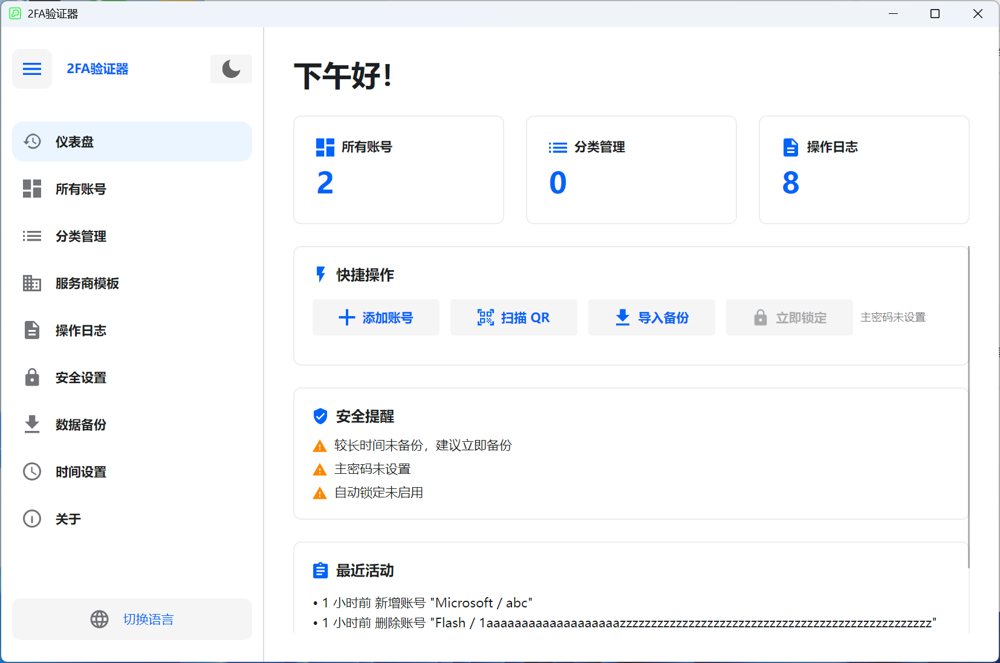

# 🔐 2FA Desktop — 跨平台双因素认证桌面客户端

一款基于 [Avalonia UI](https://avaloniaui.net/) 构建的开源桌面双因素认证（2FA）管理器，支持 TOTP / HOTP 协议，同时兼容 **Windows** 和 **Linux** 平台。

**简体中文** | **[English](README.en-US.md)** | **[Deutsch](README.de-DE.md)** | **[Español](README.es-ES.md)** | **[Français](README.fr-FR.md)** | **[日本語](README.ja-JP.md)** | **[한국어](README.ko-KR.md)** | **[Русский](README.ru-RU.md)**

---

## 📸 界面截图

<div align="center">

</div>

---

## ✨ 功能特性

### 🔑 账号管理
- 支持 **TOTP**（基于时间）和 **HOTP**（基于计数器）两种 OTP 类型
- 三种添加方式：**手动输入**、**URL 导入**（`otpauth://` 协议）、**二维码批量导入**
- 支持从 **Google Authenticator** 批量迁移导入（Google Protobuf 协议解析）
- 可自定义位数（6-8 位）和刷新周期（30-60 秒）
- 实时倒计时显示，一键复制验证码到剪贴板
- 账号置顶/收藏、搜索过滤、分类筛选
- 网格视图 / 列表视图 自由切换
- 多选模式：批量删除、批量置顶、批量移动分类
- 账号导出：支持二维码图片和 `otpauth://` URL 两种格式，支持单个或批量导出

### 📂 分类管理
- 创建、重命名、删除分类，支持添加描述/备注
- 按名称或账号数量排序
- 拖拽排序，手动调整分类顺序
- 多选合并分类：将多个分类的账号合并到目标分类
- 分类详情查看（账号数量、描述、排序位置）

### 🏢 服务商模板
- 内置常见服务商图标和颜色（如 Google、GitHub、Microsoft 等）
- 支持自定义服务商：上传 SVG 图标、设置图标颜色
- 添加账号时可快速选择服务商模板，自动填充图标
- 按名称或使用次数排序，搜索过滤

### 🔒 安全功能
- **主密码保护**：使用 BCrypt 哈希存储，AES-GCM 加密账号密钥
- **应用锁定**：启动时需输入主密码解锁
- **空闲自动锁定**：支持 1/2/5/10/15/30 分钟可选（Windows 支持全局空闲检测）
- **截图屏蔽**：Windows 10 2004+ 系统级截图/录屏保护（截图显示黑屏）
- **剪贴板自动清除**：复制验证码后自动清除剪贴板（5/10/30/60 秒可选）
- **会话加密**：运行时使用会话密钥加密敏感数据
- **安全说明面板**：直观展示当前安全状态和建议

### 💾 数据备份与恢复
- 导出为加密备份文件（`.2fabackup` 格式）
- 使用 **AES-GCM** 加密 + **HMAC-SHA256** 签名，防篡改验证
- 密钥派生使用 **PBKDF2**（200,000 次迭代）
- 可选包含应用设置和操作日志
- 导入支持两种模式：
  - **合并模式**（推荐）：保留现有数据，添加新数据
  - **覆盖模式**：清空现有数据，完全替换
- 冲突处理策略：跳过重复 / 覆盖现有 / 保留两者（重命名）
- 数据统计面板：账号数量、分类数量、最后备份时间

### ⏱ 时间设置
- 支持 **系统时间** 和 **NTP 网络时间** 两种时间源
- 内置多个 NTP 服务器：Windows Time、阿里云、腾讯云、Google、Cloudflare
- 支持添加自定义 NTP 服务器
- NTP 连接测试：显示网络时间和时间偏差
- 确保 TOTP 验证码生成的时间准确性

### 📋 操作日志
- 完整的操作审计记录（新增/更新/删除账号、导入导出、设置变更等）
- 支持分页浏览、多选删除、清空日志
- 导出日志为 CSV 文件
- 原始日志格式切换（用于调试和技术分析）
- 日志内容本地化显示

### 🎨 界面与个性化
- **浅色/深色主题** 一键切换
- **首次启动向导**：引导选择语言和主题
- **侧边栏导航**：可折叠/展开
- **仪表盘**：快捷操作、安全提醒、最近活动、数据统计
- 时间段问候语（早上好/下午好/晚上好）

### 🌍 多语言支持

| 语言 | 代码 |
|------|------|
| 🇨🇳 简体中文 | `zh-CN` |
| 🇺🇸 English | `en-US` |
| 🇩🇪 Deutsch | `de-DE` |
| 🇪🇸 Español | `es-ES` |
| 🇫🇷 Français | `fr-FR` |
| 🇯🇵 日本語 | `ja-JP` |
| 🇰🇷 한국어 | `ko-KR` |
| 🇷🇺 Русский | `ru-RU` |

---

## 🛠 技术栈

| 组件 | 技术 | 版本 |
|------|------|------|
| 运行时 | .NET | 8.0 |
| UI 框架 | Avalonia UI | 11.3.11 |
| 主题库 | Semi.Avalonia | 11.3.7.2 |
| 数据库 | SQLite (Microsoft.Data.Sqlite) | 10.0.2 |
| 密码哈希 | BCrypt.Net-Next | 4.0.3 |
| 二维码 | ZXing.Net + SkiaSharp | 0.16.11 |
| SVG 渲染 | Svg.Skia | 3.4.1 |
| 图形库 | SkiaSharp | 3.119.1 |
| Protobuf | Google.Protobuf | 3.28.3 |
| 依赖注入 | Microsoft.Extensions.DependencyInjection | 10.0.2 |
| 编译模式 | Native AOT | — |

### 架构设计
- **MVVM 模式**：ViewModel + ObservableObject 数据绑定
- **依赖注入**：Microsoft.Extensions.DependencyInjection 容器
- **仓储模式**：Data 层抽象数据访问
- **服务层**：业务逻辑与 UI 解耦
- **全异步**：async/await 保证 UI 响应性

---

## 📦 数据库结构

应用使用 SQLite 本地数据库，存储路径为：

```
# Windows
%LOCALAPPDATA%\TwoFactorAuth-Desktop\TwoFactorAuth.db

# Linux
~/.local/share/TwoFactorAuth-Desktop/TwoFactorAuth.db
```

包含以下数据表：

| 表名 | 说明 |
|------|------|
| `Accounts` | 2FA 账号数据（名称、服务商、密钥、类型、位数、周期等） |
| `Categories` | 分类信息（名称、描述、排序） |
| `Settings` | 键值对配置存储 |
| `OperationLogs` | 操作审计日志 |
| `ServiceProviders` | 服务商模板（图标、颜色） |

---

## 🚀 快速开始

### 从 Microsoft Store 安装

<a href="https://apps.microsoft.com/detail/9P178R1MVM9T?referrer=appbadge&mode=full" target="_blank" rel="noopener noreferrer">
	
</a>

### 环境要求

- [.NET 8 SDK](https://dotnet.microsoft.com/download/dotnet/8.0)
- Windows 10+ 或 Linux（Ubuntu 20.04+、Debian 11+ 等）

### 克隆项目

```bash
git clone https://github.com/salokrwhite/2fa-desktop.git
cd 2fa-desktop
```
### Windows 构建与运行

```bash
# 开发模式运行
dotnet run

# 发布 Release 版本（Native AOT）
dotnet publish -c Release -r win-x64 --self-contained true -p:PublishAot=true
```

发布后的可执行文件位于 `bin/Release/net8.0/win-x64/publish/` 目录。

### Linux 构建与运行

Linux 版本位于 `linux-desktop/` 目录：

```bash
cd linux-desktop

# 开发模式运行
dotnet run

# 发布 Release 版本（Native AOT）
dotnet publish -c Release -r linux-x64 --self-contained true -p:PublishAot=true
```

### Linux 打包为 .deb 安装包

项目提供了一键打包脚本 `linux-desktop/build-deb.sh`，支持在 WSL 和原生 Linux 环境下运行：

```bash
# 基本用法（使用默认配置）
chmod +x linux-desktop/build-deb.sh
./linux-desktop/build-deb.sh

# 自定义参数
PKG_NAME=twofactorauth-desktop \
APP_VERSION=1.0.0 \
MAINTAINER="Your Name <you@example.com>" \
./linux-desktop/build-deb.sh
```

#### 打包脚本支持的环境变量

| 变量 | 默认值 | 说明 |
|------|--------|------|
| `PKG_NAME` | `twofactorauth-desktop` | Debian 包名 |
| `APP_VERSION` | `1.0.0` | 版本号 |
| `APP_DISPLAY_NAME` | `TwoFactorAuth Desktop` | 应用显示名称 |
| `ARCH` | `amd64` | 目标架构 |
| `RUNTIME` | `linux-x64` | .NET 运行时标识 |
| `ENTRY_EXE_NAME` | `TwoFactorAuthDesktop` | 可执行文件名 |
| `MAINTAINER` | `Your Name <you@example.com>` | 维护者信息 |
| `DEPS` | `libx11-6, libice6, ...` | 运行时依赖 |
| `ICON_PNG_PATH` | `app.png` | PNG 图标路径 |
| `ICON_ICO_PATH` | `app.ico` | ICO 图标路径 |

#### 打包流程

1. **检查构建依赖**：自动安装 `clang`、`zlib1g-dev`、`dpkg-dev`
2. **NativeAOT 发布**：编译为独立的原生可执行文件
3. **构建 .deb 结构**：
   - 安装到 `/opt/twofactorauth-desktop/`
   - 创建 `/usr/bin/` 符号链接
   - 生成 `.desktop` 桌面入口文件
   - 生成 AppStream 元数据（`metainfo.xml`）
   - 安装应用图标到 `hicolor` 图标主题
4. **生成 .deb 包**：输出到 `bin/deb-staging/` 目录

#### 安装 .deb 包

```bash
sudo apt install ./bin/deb-staging/twofactorauth-desktop_1.0.0_amd64.deb
```

安装后可通过以下方式启动：
- 终端运行：`twofactorauth-desktop`
- 应用菜单：在"工具"或"安全"分类中找到 **TwoFactorAuth Desktop**

---

## 📁 项目结构

```
2fa-desktop/
├── App.axaml / App.axaml.cs          # 应用入口、主题和语言配置
├── TwoFactorAuthDesktop.csproj       # Windows 项目文件
├── Program.cs                        # 程序入口点
│
├── Models/                           # 数据模型
│   ├── Account.cs                    # 2FA 账号模型（TOTP/HOTP）
│   ├── Category.cs                   # 分类模型
│   ├── Settings.cs                   # 设置模型
│   ├── BackupData.cs                 # 备份数据结构
│   ├── ServiceProvider.cs            # 服务商模板模型
│   ├── OperationLog.cs               # 操作日志模型
│   └── ObservableObject.cs           # MVVM 可观察基类
│
├── ViewModels/                       # 视图模型层
│   ├── MainViewModel.cs              # 主窗口 ViewModel（导航、主题、语言）
│   ├── DashboardViewModel.cs         # 仪表盘（快捷操作、安全提醒）
│   ├── AccountListViewModel.cs       # 账号列表（搜索、过滤、多选）
│   ├── AccountItemViewModel.cs       # 单个账号项（OTP 显示、倒计时）
│   ├── AddAccountViewModel.cs        # 添加账号（手动/URL/二维码）
│   ├── CategoryListViewModel.cs      # 分类管理
│   ├── ServiceProviderListViewModel.cs # 服务商模板管理
│   ├── OperationLogViewModel.cs      # 操作日志
│   ├── SecuritySettingsViewModel.cs  # 安全设置
│   ├── BackupViewModel.cs            # 备份与恢复
│   ├── TimeSettingsViewModel.cs      # 时间设置
│   ├── ExportAccountViewModel.cs     # 账号导出
│   ├── LockScreenViewModel.cs        # 锁屏
│   └── ...                           # 其他对话框 ViewModel
│
├── Views/                            # 视图层（AXAML）
│   ├── MainWindow.axaml              # 主窗口（侧边栏 + 内容区）
│   ├── BackupView.axaml              # 备份与恢复页面
│   ├── LockScreenView.axaml          # 锁屏页面
│   ├── TimeSettingsView.axaml        # 时间设置页面
│   ├── Dialogs/                      # 对话框（17 个）
│   │   ├── UnifiedAddAccountDialog   # 统一添加账号对话框
│   │   ├── QrImportDialog            # 二维码批量导入
│   │   ├── ExportBackupDialog        # 导出备份
│   │   ├── ImportBackupDialog        # 导入备份
│   │   ├── ExportAccountDialog       # 导出账号
│   │   ├── PasswordDialog            # 密码输入
│   │   ├── SetPasswordDialog         # 设置密码
│   │   └── ...                       # 其他对话框
│   └── Wizard/                       # 首次启动向导
│       ├── SetupWizardView           # 向导容器
│       ├── WizardLanguageView        # 语言选择步骤
│       └── WizardThemeView           # 主题选择步骤
│
├── Services/                         # 服务层
│   ├── OtpService.cs                 # OTP 生成服务（TOTP/HOTP）
│   ├── SecurityService.cs            # 安全服务（加密/解密/密码管理）
│   ├── BackupService.cs              # 备份服务（导出/导入/加密）
│   ├── AccountService.cs             # 账号 CRUD 服务
│   ├── StorageService.cs             # 存储服务（密钥轮换）
│   ├── AutoLockManager.cs            # 自动锁定管理
│   ├── AppLockCoordinator.cs         # 应用锁定协调器
│   ├── ClipboardClearService.cs      # 剪贴板清除服务
│   ├── ScreenshotProtectionService.cs # 截图保护服务（Windows API）
│   ├── NtpTimeProvider.cs            # NTP 时间提供者
│   ├── TimeService.cs                # 时间服务
│   └── ...                           # 接口定义和其他实现
│
├── Data/                             # 数据访问层
│   ├── DatabaseContext.cs            # SQLite 数据库上下文（建表/迁移）
│   ├── AccountRepository.cs          # 账号仓储
│   ├── CategoryRepository.cs         # 分类仓储
│   ├── SettingsRepository.cs         # 设置仓储
│   ├── OperationLogRepository.cs     # 操作日志仓储
│   ├── ServiceProviderRepository.cs  # 服务商仓储
│   ├── BuiltInServiceProviders.cs    # 内置服务商数据
│   └── SettingKeys.cs                # 设置键常量
│
├── Utils/                            # 工具类
│   ├── TotpGenerator.cs              # TOTP 算法实现
│   ├── HotpGenerator.cs              # HOTP 算法实现（HMAC-SHA1）
│   ├── Base32.cs                     # Base32 编解码
│   ├── OtpUriParser.cs               # otpauth:// URI 解析器
│   ├── OtpUrlGenerator.cs            # OTP URL 生成器
│   ├── QrCodeGenerator.cs            # 二维码生成（ZXing + SkiaSharp）
│   ├── QrCodeDecoder.cs              # 二维码解码
│   ├── GoogleAuthMigrationParser.cs  # Google Authenticator 迁移解析
│   ├── SvgParser.cs / SvgImageHelper.cs # SVG 图标处理
│   └── ...                           # 其他工具
│
├── Converters/                       # XAML 值转换器
├── Controls/                         # 自定义控件（倒计时饼图）
├── Assets/Lang/                      # 多语言资源文件（8 种语言）
│
├── linux-desktop/                    # Linux 专用项目
│   ├── TwoFactorAuthDesktop.csproj   # Linux 项目文件
│   ├── build-deb.sh                  # Debian 打包脚本
│   ├── app.png                       # Linux 应用图标
│   └── ...                           # 与主项目结构相同
│
└── picture/                          # README 截图
    ├── zh-CN.png
    ├── en-US.png
    └── ...                           # 各语言界面截图
```

---

## 🔐 安全架构

### 加密方案

| 安全层 | 技术方案 |
|--------|----------|
| 密码存储 | BCrypt 哈希（自动加盐） |
| 密钥派生 | PBKDF2 (100,000 - 200,000 次迭代) |
| 数据加密 | AES-GCM (256-bit) |
| 签名验证 | HMAC-SHA256 |
| OTP 算法 | HMAC-SHA1 (RFC 4226 / RFC 6238) |

### 安全特性说明

- **无主密码模式**：数据以明文存储在本地 SQLite 数据库，适合个人设备
- **有主密码模式**：所有账号密钥使用主密码派生的密钥加密存储，即使数据库被盗也无法解密
- **备份文件加密**：使用独立的备份密码，PBKDF2 派生密钥 + AES-GCM 加密 + HMAC 签名
- **离线优先**：所有数据存储在本地，无云同步，无网络依赖（NTP 时间同步除外）

---

## 🤝 贡献指南

欢迎提交 Issue 和 Pull Request。

1. Fork 本仓库
2. 创建特性分支：`git checkout -b feature/your-feature`
3. 提交更改：`git commit -m "Add your feature"`
4. 推送分支：`git push origin feature/your-feature`
5. 提交 Pull Request

### 添加新语言

1. 复制 `Assets/Lang/en-US.axaml` 为新的语言文件（如 `Assets/Lang/pt-BR.axaml`）
2. 翻译所有字符串值
3. 在 `App.axaml.cs` 中注册新语言
4. 同步更新 `linux-desktop/Assets/Lang/` 目录

---

## 📄 开源许可

本项目基于 [MIT License](LICENSE) 开源。

Copyright © 2026 lijicheng

---

如果这个项目对你有帮助，请给一个 ⭐ Star 支持一下！

[GitHub 仓库](https://github.com/salokrwhite/2fa-desktop)
